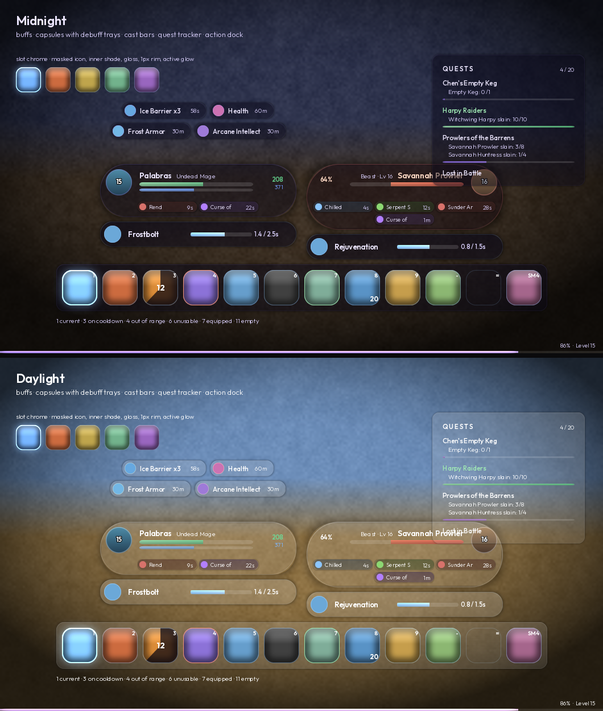

# AetherUI

A frosted-glass HUD for World of Warcraft **Classic Era** (Interface 11509), built
from the `WoW UI Concepts` deck.

Two milestones in. The **asset pipeline** and the **skin engine** came first;
on top of them sit unit frames, a cast bar, the floating **ability dock** and the
XP hairline. Quest tracker, minimap, nameplates and auras plug into the same core.



---

## What's here

```
AetherUI.toc
Bindings.xml     names bar 2's keys - the one action page Blizzard never named
Core/
  Core.lua       namespace, module registry, one shared event pump + ticker
  Media.lua      every texture and font path; LibSharedMedia registration
  Palette.lua    colour tokens; the two skins from the deck
  Glass.lua      the frosted surface: 9-slice panels, 3-slice pills, shadows
  Widgets.lua    bars, orbs, icon slots, text
  Config.lua     AceDB saved variables and profiles
  Movers.lua     drag-to-place with grid and edge snapping, persisted per profile
  Fader.lua      the "HUD breathes out" idle behaviour
  Commands.lua   /aether
  Options.lua    the AceConfig tree; every leaf carries its own path
Modules/
  UnitFrames.lua player + target capsules, player cast bar, click targeting
  ActionBars.lua independent bars: secure buttons, stance/pet/extra, keybinds
  Auras.lua      four aura trays: buffs above each capsule, debuffs below
  QuestTracker.lua  the glass panel: tracked quests, objectives, combat fold
  QuestLog.lua   the full log window; replaces Blizzard's rather than skinning it
  Bags.lua       one unified inventory panel, plus the bank beside it at a banker
  Chat.lua       Blizzard's chat frames, skinned in place
  Zen.lua        the second stage of the fade
  Minimap.lua    round map, zone/coords/clock pill, addon-button drawer
  XPBar.lua      the bottom-of-screen experience hairline
Media/
  Textures/      26 generated TGAs
  Fonts/         Outfit, 5 weights (SIL OFL, licence included)
Libs/            LibStub, CallbackHandler, AceDB-3.0, AceGUI-3.0, AceConfig-3.0,
                 AceConsole-3.0, AceDBOptions-3.0, LibSharedMedia-3.0,
                 LibClassicCasterino
Tools/
  generate_textures.py   regenerates every texture from source
  preview.py             renders the skin outside the game (the image above)
  harness.lua            mock WoW API; runs the addon end to end
```

## Install

Copy the `AetherUI` folder into
`_classic_era_\Interface\AddOns\`, then `/reload`.

## Commands

```
/aether bind              hover a button, press a key; escape clears
/aether unlock            drag frames; scroll to nudge, shift-scroll for x
                          edges snap to the grid and to other frames; alt to override
                          cast bars and conditional bars are held up so you can place them
/aether lock
/aether reset             forget all frame positions
/aether skin midnight|daylight
/aether scale 0.6-1.6     0.71 reproduces the deck's proportions
/aether fade on|off|delay N|idle 0-1        stage one, the dim
/aether zen on|off|delay N|afk on|off|test  stage two, the readout
/aether shadow 0-1        ambient shadow opacity
/aether health class|deck  player bar colour (class-coloured by default)
/aether bar scale N       size the dock independently of everything else
/aether bar size N        action button size (concept draws 62)
/aether bar columns N     buttons per row
/aether bar font N        points added to keybind / count / cooldown text
/aether chat lines on|off      class-coloured names, em dash, badges
/aether chat badges on|off
/aether chat whispers on|off   move whispers to a tab of their own
/aether chat reskin
/aether diag              why is a Blizzard frame still on screen; what the
                          minimap drawer collected
/aether chat              ...and what the line work managed to install
/aether module <name> on|off
/aether status
```

---

## A note on sizes

Module geometry is written in the concept deck's own pixel values — 62px slots,
9px gaps, a 46px portrait orb. The deck is 1920 wide; WoW's virtual coordinate
space is 768 tall, so 1365 wide at 16:9. `scale` therefore defaults to **0.71**
(1365/1920), which maps one onto the other exactly. Raise it if you want
everything bigger than the deck; the numbers in the source stay readable against
the reference either way.

## The one thing the concepts ask for that the client cannot do

The deck is built on CSS `backdrop-filter: blur()`. **There is no runtime blur in
the WoW UI.** No shader hooks, no render-to-texture for arbitrary frames, nothing
that samples the world behind a frame. That is not a Classic limitation; it is
true on Retail too.

So the approach here is to ask what frosted glass actually reads from. It's four
cues, and blur is only one:

1. translucency — a tinted, partly transparent fill
2. a bright catching rim — separate from the fill, tinted independently
3. a top-light falloff — baked into the fill's alpha ramp
4. fine surface grain

Three of the four survive intact, and in motion the missing one is genuinely hard
to notice. What people recognise as "glass" is the rim and the falloff.

### Grain has to live in alpha, and it has to be baked in

Both halves of that sentence were learned the hard way, from a screenshot.

The first attempt layered a separate `Noise` texture over each surface. A layered
texture can only be anchored to the **centre slice** — there is no mask that
follows an arbitrary-width capsule — so it stopped dead at the rounded caps,
leaving a visibly brighter rectangle with a hard vertical seam at each end. It
was also stretched: on a 3840×1600 display the capsule's centre slice is ~415
physical pixels wide, so a 128px noise tile was smeared 3.2× and read as
blotches rather than grain.

The subtler half: that noise varied its **RGB** at a flat alpha, which composites
as a *wash*, not a texture. Worse, RGB variation is pointless here anyway. These
textures are white and get tinted dark at runtime, so a 3% RGB wobble on Midnight
glass (tint `0.047`, alpha `0.55`) lands at about `0.001` of final output —
invisible. Only **alpha** variation does anything: letting marginally more or
less of the world through per texel is what actually reads as frost.

So the grain is now zero-mean multiplicative variation on the fill textures'
alpha channel, generated with the shape. It covers the caps, it cannot seam, and
there is nothing to layer or configure.

## How the assets work

Every texture is **neutral greyscale**. Colour is applied at runtime with
`SetVertexColor`, which means:

- one asset set drives every skin — a new skin costs no art, just a colour table
- users can recolour anything without touching a file
- fill and rim are separate textures, so a purple rim on dark glass is one line

`Tools/generate_textures.py` regenerates the lot. Rules it enforces:

- power-of-two on both axes
- 32-bit uncompressed TGA, top-left origin (descriptor `0x28`)
- straight alpha, with RGB **bled** outward into transparent texels — otherwise
  the client's bilinear filter pulls black in and haloes every rounded corner
- shapes drawn at 4× and downsampled with Lanczos

### The bright corners were the shadow, not the rim

Four pale patches, one at each corner of every pill. Reported three times. I
attributed it to the rim's width, then to a rasterisation artefact at 45°, then
to pixel snapping — plausible each time, wrong each time, and each "fix" changed
something real without touching the cause.

What settled it was reproducing the composite offline instead of reasoning about
it: 3-slice the fill and the rim exactly as the client does, composite the
shadow under them over a bright background, and measure the luminance just
outside the pill at a corner against the same point along an edge. **0.544 at the
corner, 0.589 along the edge** — the corner was *brighter*, and it was brighter
because there was **no shadow being drawn there at all.**

The pill shadow is drawn at spread = height/4, so in its 128-texel height the
pill's own edge is a circle of radius 128/3 = 42.7 about the cap centre. Its hole
was a rounded rectangle of radius **34** in a 128-tall space — noticeably squarer
than a capsule. A squarer shape extends *further* at 45° than the circle it
stands in for, so around each corner the pill's edge fell **2.2 texels inside the
hole**, and in that band the shadow was cut away. Along the straight edges, where
a rounded rect and a capsule agree, the shadow reached the pill exactly as
intended — which is why the artefact was corners-only and looked like a rim
problem.

Both shapes are true capsules now, concentric with the pill, with the hole
deliberately ~2 texels *smaller* so its edge hides under the glass. The old
comment in the generator claimed the extra squareness "sits underneath the pill
where nothing can see them"; it sat outside it, at the corners, which is the one
place it could be seen.

The first attempt at the replacement then went too far the other way — a core
radius of 58 against the pill's 42.7 is not a falloff, it is a solid ring of
black standing off the frame. The core sits just about *on* the pill's edge now
and the blur carries it outward from there: peak 0.38 immediately outside the
glass, gone by 16 texels. Measured across the corner and the two edges:
**0.621, 0.600, 0.608** — within a fiftieth of each other, where it started at
0.544 against 0.589.

The lesson is not about capsules. Three times I diagnosed a rendering artefact
from a screenshot and a plausible mechanism, and three times I was wrong; the
diagnosis that held took twenty lines of numpy that composited the thing and read
the pixels back.

### Why it came out softer in game than in the mockup

Both halves of this were fixable, and neither was the client refusing to draw
something.

**Pixel snapping stays on, and getting that backwards cost three deliveries.**
My first theory was that nine pieces each rounding their own edges to the grid
must be what seams a nine-slice, so every piece called
`SetSnapToPixelGrid(false)`. That is exactly backwards, and it made the artefact
worse rather than better.

These slices **abut**: the centre's left edge *is* the left cap's right edge.
Snapped, both land on the same integer pixel and the shape tiles seamlessly.
Unsnapped, they land on the same *fractional* pixel — so the boundary pixel is
partially covered by both quads and the rim there is alpha-blended twice. Two 50%
fragments compose to 75%, not 50%: a bright dot wherever a seam crosses the rim.

A 3-slice pill's seam runs vertically at `x = cap`, which is precisely where the
cap's arc becomes the straight top and bottom edge. Four seam crossings, four
bright dots, one at each corner — which is exactly what was reported, twice, and
which I twice attributed to something else. Snapping is what prevents it; that is
the whole reason the feature exists. If a seam ever does show, the fix belongs in
the *texture* — a rim wide and soft enough to survive a pixel of misalignment —
not in the snapping.

**Rim brightness must not depend on angle.** The second attempt at the rim was
the right width and still wrong: built as `blur(outer - inner)` and then
normalised by its own maximum. PIL's `rounded_rectangle` draws a corner as a
pieslice butted against two rectangles, and its worst rasterisation error is at
45° — the middle of each corner arc. A fraction of a texel, invisible on a solid
fill. But a rim built from the difference of two such masks inherits the error
from both, and dividing by the peak then scales the *whole ring* down to suit the
one artefact: the 45° points sit at full brightness and everything else is dimmed
relative to them. Four bright spots per shape, one per corner, in the same place
every time.

Every shape now comes from an analytic **signed distance field** rather than a
rasteriser. A distance field has no corners to rasterise, the band is the same
width at every angle because it is defined *as* a distance, and anti-aliasing
falls out of the distance instead of being sampled for. Measured as brightness
variation at a fixed distance from the edge: **0.37 before, 0.04 after.**

**A one-texel rim does not survive being minified.** The rims were authored one
texel wide, which is perfect at 1:1 and falls apart anywhere else. A panel corner
authored at 32 texels is drawn at about 16 physical pixels; a pill cap authored
at 64 is drawn at 17–42, so it is minified by up to 3.8×. Bilinear filtering only
samples a 2×2 neighbourhood, so some columns land on the rim texel and come out
at full brightness while the ones beside them miss it entirely — white speckling
along the edges, and no amount of tinting hides it. The rims are ~3 texels wide
with a feathered inner side now, so minification makes them thinner and softer
rather than dashed.

**A shape needs room for its own anti-aliasing.** This is the one that produced
"it's like there is no feathering at all", and that description was literally
correct. A capsule of radius 128 authored in a 256-tall texture reaches the
topmost texel row at alpha 1.0 — its anti-aliasing ramp would have to live
*outside* the texture, and there is no outside. The edge was a hard cut, and the
client faithfully reproduced a hard cut at whatever size it drew it. Every shape
is now inset by a `MARGIN` of 2 texels so the ramp has somewhere to be.

**And the ramp has to be wider than one texel.** The textbook coverage function
is `clip(0.5 - d)`, a one-texel ramp, and it only produces an intermediate value
when the edge happens to fall near a texel centre. Land it on a boundary instead
and you get 1.0 next to 0.0 — a hard edge wearing a feathered edge's clothing,
which is exactly what the first `MARGIN` fix produced. `AA` is 1.8 texels; these
are authored at 2× and minified, so that arrives as one clean pixel of
anti-aliasing whatever phase the edge lands on.

The rim had the same fault at its *outer* side: it tapered to zero exactly at the
boundary, so its outermost lit texel had nothing beyond it. It now tapers to zero
`AA/2` texels outside the shape.

**Author at 2× the drawn size, not 1×.** I worked out that a 256×128 pill is
exactly 1:1 on a 4K display and concluded that was optimal. It is optimal for
*sharpness* and wrong for *curves*: at 1:1 the only anti-aliasing on an arc is
the single texel the generator puts there, and one texel of AA is visible
stair-stepping. Minified 2×, bilinear averages a 2×2 footprint per pixel — four
samples on the curve instead of one — and the edge comes out genuinely smooth.
The glass pill and panel are authored at 512×256 and 256×256 for that reason.

**Grain in a sliced fill has a ceiling.** A nine-slice stretches its centre and
does not stretch its corners, so the same noise field arrives at one scale in the
middle and another at the edges — and any amplitude high enough to see is high
enough to show a seam where the two meet. That was the darker notch sitting
exactly where a pill's cap joined its body. `GRAIN` is 0.022 now rather than
0.07, which is honest about what it is: the frost is really being sold by the rim
and the falloff, and always was.

### Slice geometry

Panels are 9-slice, pills are 3-slice, both from a single texture via
`SetTexCoord`. The fractions are a contract between `Core/Media.lua` and the
generator:

| texture | size | slice | note |
|---|---|---|---|
| `Glass-Panel` / `-Edge` | 256×256 | 0.25 | corner radius 64 |
| `Glass-Pill` / `-Edge` | 512×256 | 0.25 | cap 128; caps stay circular, so their rendered width is always height/2 |
| `Glass-Shadow` | 256×256 | **0.375** | corner 96; drawn at piece = 2×corner, offset corner/2 |
| `Glass-Pill-Shadow` | 512×256 | 0.25 | drawn at spread = height/4; both shapes are true capsules |

Two of those numbers are load-bearing and worth knowing before you edit the
generator:

- **The shadow's corner slice is 0.375, not 0.25.** All of the hole's curvature
  *plus the blur spill* has to fit inside the corner slice. If it doesn't, the
  edge slices stop being uniform along their stretch axis and you get a visible
  seam whenever a panel is wide. The panel shadow's geometry (inset 24, radius
  48, blur 8, on a 256px texture) lands at 92 of the 96 available texels.

- **Neither shadow takes a free "spread" distance.** Both are authored for one
  fixed relationship to the shape above them, because that is the only way the
  hole can line up with the shape's own curve. Panels are drawn with a corner
  piece of `2 × corner`, offset `corner/2` outward, at which ratio the hole
  renders at exactly the panel's corner radius. Pills use spread = `height/4`.
  `glass.shadow` is therefore an **opacity**, not a distance.

  This one was a real bug, and a subtle one: the first version let the caller
  pick a spread, and the hole ended up rendering at a 2px radius under a 14px
  rounded corner. The 12px in between had no panel *and* no shadow, so every
  corner showed a transparent square notch. The capsules were fine throughout,
  which is what gave it away — their shadow was already ratio-derived.

- **Both shadows are hollow.** They subtract a slightly shrunk copy of the body,
  exactly like CSS `box-shadow`, which is clipped to outside the border box.
  Without that the shadow is a solid black slab sitting behind translucent glass
  and the whole material reads as opaque. This was wrong in the first pass and
  the preview render is what caught it.

- **Pills get their own shadow.** Reusing the rectangular 9-slice under a capsule
  leaves a boxy halo poking past the round ends, and it's the first thing the eye
  catches. `Glass-Pill-Shadow` is authored for one fixed ratio — spread =
  height/4 — at which the body edge lands on texel 21 and the cap on texel 64
  *regardless of the pill's actual size*, so one asset covers every capsule.

### Masks

Icons, orbs and bar ends are rounded with `MaskTexture`, which Classic Era does
have. Every use is guarded: on a client without it you get square corners, not an
error.

Bar rounding is worth a note. `Bar-Mask` is a 256×16 capsule; stretched onto a
200×7 bar the caps land at about 6×7 px. A slight horizontal squash on a shape
that small is invisible, and it beats square ends. The mask is anchored to the
bar's **full** extent and shared by fill and background, so a depleting bar keeps
a square leading edge — a rounded head reads as "nearly empty" at a glance.

## Fonts

Outfit (the deck's typeface), five weights, latin + latin-ext subsets merged.
Built from the `@fontsource/outfit` package; SIL OFL 1.1, licence shipped
alongside.

Modules never name a weight. They ask for a **role** — `unitName`, `castTime`,
`keybind` — and `Media.style` maps roles to weight/size/outline. Retuning the
type is one table.

Where a module needs to deviate it *offsets* from the role rather than hard-coding
a size, via `Media:Size(role)`. The action bar's `fontDelta` works this way, so
the roles stay the single source of truth. Worth remembering that the dock is
drawn at `profile.scale`, so +2 points there lands at about +1.4 on screen at the
default 0.71.

## Testing without the game

`Tools/harness.lua` mocks enough of the WoW API to load the addon end to end and
drive it through a session: boot, health churn, target switching, casting, the
idle fader, skin switching, movers, every slash command, a resolution change,
the whole action bar (icons, states, cooldowns, keybind abbreviation, drag and
drop), the XP hairline, the cast bar advancing on its own per-frame handler, and
that combat-gated work actually defers and replays.
Runs in about a second:

```sh
lua5.1 Tools/harness.lua      # ~1000 checks
python3 Tools/preview.py      # re-render the skin preview
```

**If there is no `lua5.1` on the machine**, run it through Python's `lupa`, which
embeds a real 5.1. The Ace libraries need 5.1 specifically -- bare `unpack`,
`setfenv` -- so `lupa.LuaRuntime` is the wrong entry point; it is 5.4.

```sh
python3 -m pip install lupa
cd <repo root>                 # required: harness.lua loads by relative path
python3 -c "import lupa.lua51 as l; \
  l.LuaRuntime(unpack_returned_tuples=True).execute(open('Tools/harness.lua').read())"
```

`os.exit(1)` on failure exits the Python process with status 1, so it works as a
CI gate unchanged.

### Mutation-test the assertions

A check that cannot fail is worse than no check, because it is also a claim. The
routine that has caught the most here is: break the thing on purpose, one edit at
a time, and confirm the harness goes red. Every `== bags:` block was written that
way -- 31 deliberate breakages, all caught -- and three of the assertions were
rewritten because the first version of them passed against the broken code. One
compared two values that came from the same suspect source and therefore always
agreed with itself; two others tested a state the scenario never actually
reached.

**When a mutation is NOT caught, check whether the scenario reaches that code at
all before concluding the guard works.**

It catches the class of bug you cannot see by reading — nil field access, methods
that don't exist on the widget type you used, file ordering, anchors pointing at
regions that weren't built yet. It is not a substitute for the client, but
everything it does catch, it catches in a second instead of a `/reload`.

## Working with secure frames

The dock is the first part that has to be *secure* — casting a spell is a
protected action, so the buttons are real `SecureActionButtonTemplate` widgets.
Three consequences shape `Modules/ActionBars.lua`:

1. **Paging cannot be done in Lua.** Stances, druid forms and the 1–6 page keys
   can all change mid-combat. So paging runs as a secure state driver on a
   `SecureHandlerStateTemplate` header, which pushes the new page down to every
   child button via `control:ChildUpdate`. Lua only *reads* the resulting action
   id back to repaint the artwork.

2. **Keybinds are override bindings.** Blizzard's binding handlers act on
   Blizzard's buttons, which we hide, so we read the key bound to each
   `ACTIONBUTTON<n>` and redirect it at ours with `SetOverrideBindingClick`.

3. **Everything structural is combat-gated.** Resize, reposition, rebind and
   rebuild all check `InCombatLockdown()` and replay on `PLAYER_REGEN_ENABLED`.

The restricted snippets are strings, so a typo in one is silent — it just shows
up later as "my druid's bar stopped working". The harness parses each snippet
with `loadstring` for that reason.

### Classic Era 1.15 runs the *modern* bar system

Worth knowing before editing any of this: 1.15 is not the old Classic UI. A dump
of `UIParent`'s children shows `MainActionBar`, `PetActionBar`,
`PossessActionBar`, `UIParentBottomManagedFrameContainer` and an
`EditModeManagerFrame` — the Dragonflight-derived layout, not `MainMenuBar` with
gryphon art. Both name sets are in the banish list; `/aether diag` reports
`absent` for whichever isn't present on your build.

`UIParent` also has **forbidden** children (the in-game shop among them). Any
method call on a forbidden frame — including `GetName` — raises `calling '?' on
bad self`. Every traversal here checks `IsForbidden` before touching anything,
and treats a failed check as forbidden.

The pet bar is deliberately *not* hidden. Taking a warlock's or hunter's pet
controls away with nothing to replace them is worse than a moment's visual
inconsistency; it goes when the chrome module gives it a home.

### Removing Blizzard's bars takes four passes, not a list

A hard-coded list of frame names is wrong on some version of the client, and the
failure is silent — a frame simply stays on screen. So `HideBlizzard` does four
things and reports on each, which `/aether diag` prints:

1. the names we know
2. the micro menu, iterated from Blizzard's own `MICRO_BUTTONS` table rather than
   ours, so it survives renames
3. a walk **up** from `ActionButton1..12` to whatever actually parents them
4. a pattern sweep of `UIParent`'s descendants, two levels deep

Each frame is hidden with one `pcall` *per call* — bundling `UnregisterAllEvents`,
`Hide` and `SetParent` into a single `pcall` meant a throw on the first silently
skipped the other two. It also hooks `OnShow` to re-hide, out of combat only,
because Blizzard's bar code re-shows these from handlers we can't unregister.

### Bars are independent. Nothing pages.

This is the second design, and the first one was wrong.

Paging meant one dock whose twelve buttons pointed at a different block of
actions depending on `GetActionBarPage()` — a number this addon does not own and
cannot keep still. Anything can write it: `NEXTACTIONPAGE` is bindable, Blizzard's
own bar code writes it, and on this install it moved during ordinary play. An
unfilled page shows an empty dock, and when it moved there was no way to tell
whether the bar or the page was at fault. Three rounds of bugs came out of that
one dependency.

So it is gone. Every bar names its own source once, at build time, and never
changes it:

| kind | source | count |
|---|---|---|
| `action` | page 1–10; bar N owns actions `(N-1)*12+1` upward | `buttons`, 1–12 |
| `stance` | `GetNumShapeshiftForms` | however many you have |
| `pet` | the ten pet slots | 10 |

A button's `action` attribute is written when it is created and **never written
again**. No state driver, no restricted snippet, nothing that has to survive a
combat lockdown, and the attribute Lua reads to paint the icon is the same one
the click uses — which is what made the "shows page 1, casts page 6" split
possible in the first place.

Form bars are not lost by this. Pages **7–10 are the bonus bars**, so a druid
points a bar at page 7 and simply *sees* their Bear abilities all the time rather
than having a bar swap under them.

Bindings are derived from the page unless you name one, so bar 6 picks up the
`MULTIACTIONBAR1` keys you have always used for it; stance and pet take
`SHAPESHIFTBUTTON` and `BONUSACTIONBUTTON`.

### Configuring bars

```
/aether bar list                    what exists and what it points at
/aether bar 3 on                    switch a bar on, live
/aether bar 3 page 7                re-address it without a rebuild
/aether bar 3 buttons 6             1-12 (action bars only)
/aether bar 3 rows 3                columns fall out of it
/aether bar 3 scale 0.8             per bar, on top of the global scale
/aether bar 3 backdrop              toggle the glass panel
/aether bar size|spacing|font N     all bars at once
```

`rows` is the control and columns fall out of it: "three rows of ten" giving
4/4/2 is what people mean, where "four columns of ten" makes you do the
arithmetic first. Frames cannot be destroyed in this API, so asking for fewer
buttons hides the surplus rather than leaking a second set.

### Stance and pet buttons

Both come from Blizzard's own `StanceButtonTemplate` and `PetActionButtonTemplate`
with `SetID`. Not laziness: those templates carry the secure click behaviour for
actions that are protected on this client, and reproducing it by hand means
guessing at attribute names that are not written down anywhere. We take the
button and drive the *look* ourselves — stock artwork hidden, glass chrome on
top — which is the same split the action buttons already use.

Two details worth keeping:

- A pet "token" action reports the **name of a global** rather than a texture
  path; used directly it draws nothing.
- The pet bar's visibility is a **secure state driver** (`[pet] show; hide`), not
  a Lua `Show`/`Hide`. A pet can be dismissed mid-fight.

### Adopted buttons: taxi and extra action

Classic Era has no *vehicle UI* — no `[vehicleui]`, no seat bar — but it reuses
Blizzard's vehicle-leave button for **"land at the next flight master"** on a
taxi, and that is a real control with no replacement. The first pass banished it
by name along with the rest of `MainMenuBar`'s furniture, which quietly cost you
the only way off a flight path early. It is off the banish list.

Both it and `ExtraActionButton1` fire **protected** actions
(`TaxiRequestEarlyLanding`, whatever a quest binds), so there is no recreating
them the way the action buttons are recreated. The `extra` bar **adopts the real
frames** — reparents them onto a glass dock, sizes them, takes the ornate ring
off the extra action button — and leaves their click behaviour entirely alone.

Three consequences worth knowing:

- Adoption only happens **out of combat**, because reparenting a protected frame
  is itself protected. The layout pass skips adopted buttons mid-fight, so one
  keeps its last position until the fight ends rather than throwing.
- Adoption is **retried**, because `ExtraActionButton1` may not exist until its
  addon loads — and it hides the button on the way in, so nothing is on screen
  until the game says it has a job.
- Visibility comes from **the game**, not from the frame. This one cost a round:
  reparenting a frame does not change its own shown state, and Blizzard's taxi
  button is `Show()`n from the start — invisible only because the bar it hangs
  off is hidden. Adopt it onto a dock of your own and it appears, empty, and
  stays. So each adopted button carries a `relevant()` predicate
  (`UnitOnTaxi`, `HasExtraActionBar`) and the dock follows that. A button that
  shows itself for its own reasons no longer drags the dock up with it.

Possess (mind control) still keeps Blizzard's own bar — rare, temporary, and
there is no vehicle UI here for it to share code with.

### Blizzard's buttons outlive their bars

Hiding `MainActionBar` does not stop `ActionButton1..12` — they are still working
secure buttons, and `MainActionBar`'s own override bindings still re-point the
`ACTIONBUTTON` keys at them whenever the modern bar code updates. Override
bindings are last-writer-wins, and it was not reliably us.

Each Blizzard button now gets `Hide`, `UnregisterAllEvents` and **`statehidden`**
— the flag its own secure visibility drivers check — and `ClearOverrideBindings`
runs on Blizzard's bar frames *before* we set ours, every time, so the order is
deterministic rather than a race. `/aether diag` reports how many of the twelve
keys resolve to our buttons and names the owner of any that don't.

### Keybinding

`/aether bind` (or the button on the General page) drops an overlay on every
button on every enabled bar. Hover one, press a key. Escape clears it,
right-click leaves, and the mouse wheel and buttons 3–5 count as keys.

Keyboard focus follows the mouse rather than being claimed globally — enabled on
`OnEnter`, dropped on `OnLeave` — so exactly one overlay is listening at a time
and it is the one under the cursor.

**Two bugs lived in that sentence.**

`SetPropagateKeyboardInput(false)` was called once, on `OnEnter`. The client
**resets propagation for every keyboard event**, so a single call there covers
exactly nothing: the press reached our handler *and then went on to the binding
system*. Binding ctrl-1 onto bar 3 therefore also fired whatever ctrl-1 already
did — which is why it looked unbound but still answered "you need a target". On
bars 1 and 2, where the stock override bindings had already been cleared, the
same fault only showed up as the first press seeming to vanish. It is now
swallowed inside `OnKeyDown` itself, and in `OnKeyUp` for the other half of the
press.

Second, bind mode opens from a slash command or the options panel, so the cursor
is wherever it already was. If that happened to be **over a button, no `OnEnter`
ever fired** and that overlay never took keyboard focus — the "I had to hover off
and back on again before it would take" symptom. `SetBindMode` now hands focus to
whatever is already underneath the cursor.

A successful bind prints what it did, so there is no guessing whether it landed.

**The keys go into Blizzard's own binding set, not into our saved variables.**
`SetBinding` then `SaveBindings(GetCurrentBindingSet())`, exactly as the stock
keybinding panel does. That means they show up in Blizzard's panel, they survive
this addon being disabled, and there is only one place a key can come from. An
addon that keeps its own bindings table gives you two answers to "what is 3 bound
to" and no way to tell which one the client will use.

Assigning a key that something else owns takes it, and says so in chat. The
alternative is two owners and letting the client pick, which is the bug rather
than the polite version of it.

Adopted Blizzard buttons — the taxi and extra-action ones — are skipped. They
keep whatever binding Blizzard gave them; they are not ours to rebind.

**Bar 2 is why `Bindings.xml` exists.** Bar 1 binds through `ACTIONBUTTON1..12`
and bars 3–6 through the four `MULTIACTIONBAR` sets, but the second action page
is the one Blizzard never named a binding for — the stock UI reaches it by paging
bar 1, which is the exact behaviour this addon removed. Without a name there is
nothing for a key to be assigned *to*, so `Bindings.xml` declares
`AETHERUI_BAR2BUTTON1..12` under its own header and one mechanism serves every
bar. (`Bindings.xml` is picked up by the client automatically and must **not** be
listed in the TOC.)

### Two small button bugs with the same shape

**A moved stack left its count behind.** `GetActionCount` on a slot that no
longer holds anything keeps answering with the number the departed stack had, so
`b.count` is asked only when `HasAction` says there is something there to count.
The refresh also listens for `ACTIONBAR_SHOWGRID`, `ACTIONBAR_HIDEGRID` and
`CURSOR_UPDATE`, which is what tells us a drag happened at all.

**Shift-dragging an action cast it instead of picking it up.** That was ours, not
Blizzard's: `RegisterForClicks("AnyDown")` fires the click on mouse-*down*, which
lands before a drag can start. The fix is to give the modified click nothing to
do — the secure handler consults `shift-type1` before `type`, and an empty string
there is a click that returns without acting, leaving the drag to happen.

Which modifier that is belongs to the player, so it is read from
`GetModifiedClick("PICKUPACTION")` and re-applied on `UPDATE_BINDINGS` and
`CVAR_UPDATE`. Set it to ctrl in Blizzard's settings and ctrl is what gets
neutered; set it to none and nothing is touched.

## Auras

Four trays, one per unit per kind: **buffs above each capsule, debuffs below**,
on the player and the target alike. Every tray is built from the same tile: the
deck's own frosted buff pill with the name taken out of the middle, leaving a
circular icon on the left, a stack count on its corner and the time remaining on
the right.

The first attempt put the timer *underneath* the icon and dropped the pill
entirely. It read badly — the auras stopped looking like part of the same HUD,
and the number sat far enough from its icon that a row of them scanned as two
separate rows of things. The pill is back; only the name is gone.

### Why they came out of the capsule

The first design put debuff pills *inside* the capsule, under the bars, and grew
the capsule downward to wrap them. It worked, and it was wrong: the frames
resized constantly, and a player with a debuff sitting next to a target without
one gave you two frames of visibly different heights side by side.

Taking the auras out fixes both at once. Nothing grows, the two capsules are
always the same shape, and the trays extend into empty space above and below
where a changing height costs nothing at all.

**Dropping the name falls out of the same decision.** A named pill is ~100px wide
and three of them already overflowed a 345px capsule — which is why the old tray
had a `minColumn` setting and an apologetic comment about six characters not
being a name. Without the name the same pill is ~70px and four fit. The name is
on the tooltip, which is where you go when you don't already recognise the icon;
if you do recognise it, the name was only ever taking up room the timer wanted.

The timer field is **fixed width**, so a ticking "10m → 9m" cannot resize the
pill and shuffle the row sideways once a second — and a permanent aura with no
timer at all comes out exactly as wide as everything else, which is what keeps
the grid a grid.

With the name gone, the **ring is the only thing left saying what kind of thing
is on you**, so it carries the debuff's school colour at full strength — frost
blue for Chilled, purple for a Curse — where it used to be a subtle tint on a
pill's fill.

### Nothing exceeds the frame it belongs to

Columns are **derived, never configured**. A tray spans its capsule exactly, so
"how many fit" is arithmetic on the frame's real width:

```lua
local cols = math.max(1, math.floor((avail + gap) / (size + gap)))
```

`size` there is the **pill**, not the icon inside it. Sizing the grid off the
icon alone is exactly how this first came out at thirteen columns in a frame with
room for four.

That is the whole of "a tray never sticks out past its unit" — there is no width
to exceed, because the width is where the column count came from. It also means
the answer stays right after a resolution change, a scale change or a wider
capsule, without anyone having to remember to update a number. At the default
345px capsule and a 22px icon it lands on 4 across. `auras.perRow` caps it lower;
`0` means "as many as fit".

Rows grow **away** from the capsule, so the row nearest the frame stays put as
auras come and go.

Within a row, pills are **centred, per row**. Mirroring the unit's own name and
readout — left on the player, right on the target — was the first answer, and it
looked wrong for a reason worth writing down: a row of pills almost never divides
evenly into a capsule. Four across a 345px frame leave ~49px over, and pushed
entirely onto one side that gap reads as a fifth pill that failed to load. Split
into two margins it reads as margin. Centring *per row* rather than as a block
also means a short last row sits under the middle of the one above it, which is
the only arrangement that doesn't look like something is missing from one side.

`auras.align = "MIRROR"` puts it back the other way.

### Whose cast bar is that?

The two cast bars sit one above the other in the same spot, and both were the
concept's blue. Mid-fight the only thing telling them apart was the spell name,
which is the slowest thing on either bar to read.

So the target's capsule rim, orb ring and **cast bar** now take the target's
reaction — hostile red, neutral amber, friendly green — while yours stays blue.
The glow takes the bar's own head colour rather than staying on `castGlow`, which
would have put a blue halo around a red bar.

Two smaller things fell out of it:

- `ReactionEdge` used to return the `targetEdge` token, which is a flat red on
  midnight and a flat **white** on daylight. On one of the two skins the rim was
  carrying no reaction information at all. It is built from the reaction tokens
  now, and at 0.55 rather than 0.35 — visible if you look was not the same as
  tellable apart at a glance.
- It also short-circuits on `"player"`, because `UnitReaction("player", "player")`
  answers friendly and the orb ring was picking that up. True, and useless:
  reaction is information about somebody else.

`modules.unitframes.reactionTint` turns the lot off.

### The cast bars float free

Both of them, each on its own mover, well above the cluster. Neither can be
attached to a capsule any more for a simple reason: **every edge of a capsule is
now spoken for.** Buffs grow off the top, debuffs off the bottom, on both units.
A bar tied to either edge would be shoved around by whatever auras happened to be
up — which is the same jumping the whole rework exists to remove.

Floating isn't a compromise here. A cast bar is on screen only while something is
casting, so the space it occupies costs nothing the rest of the time, and putting
it up near where you are actually looking is where it wants to be anyway. The
target's defaults above the player's, because that is the order the two things
are happening in front of you.

Unlock **previews** them, via the same `preview(show)` callback the pet bar and
taxi button use — a bar you can only ever see mid-cast is a bar you could never
aim at. The preview puts a name and a part-filled bar in it so there is something
to judge a position by.

### The capsule is two frames, and now nothing resizes

```
f            plain Frame, fixed size. Movers, the fader, the aura trays and
             every child anchor here.
  f.glass    the visible pill, filling the core exactly.
  f.click    a secure unit button covering the core. Left-click targets,
             right-click opens the unit menu.
```

The split used to be load-bearing: `SetHeight` is **protected on a frame carrying
a secure template**, debuffs land in combat, and a capsule that *was* the secure
button could never have grown when it needed to. Making the click-catcher a child
left everything we resized unprotected.

Nothing resizes now, so that argument is retired — but the split stays, because
it keeps the one frame with a secure template on it at a **fixed size for its
whole life**, and that is a promise worth not breaking. The same reasoning still
governs visibility: `RegisterUnitWatch` drives the button, and the core (a plain
Frame) is ours to `Hide()` whenever we like.

The trays are children of the capsule, so they inherit its fade and its scale and
follow it wherever you drag it. Reparenting is the one protected-adjacent thing
left — the player's buff tiles carry secure cancel buttons — so it happens once
and defers out of a fight rather than arguing with the lockdown.

### `Hide()` is not per-object, and that cost a combat bug

`SetPoint` and `SetHeight` are protected **per object**: a plain Frame that
merely parents a secure button is still a plain Frame, and moving or resizing it
is fine. A comment in `SetVisible` said so, and then generalised — hiding the
capsule core on losing your target. In combat that threw:

```
ADDON BLOCKED: Frame:Hide()
  UnitFrames.lua: SetVisible
```

**`Hide` is not per-object.** Hiding a frame changes the effective visibility of
everything underneath it, and the client refuses when something underneath is
protected. The core parents the secure click-catcher, so it can never be hidden
mid-fight.

Nothing needed it hidden. `SetVisible` now hides the **glass**, which is
everything you can actually see and has no protected descendants; the
click-catcher's own visibility was already `RegisterUnitWatch`'s job, which is
secure and works in combat.

The same rule bites harder in the aura trays, where auras come and go *constantly*
during a fight and every player buff tile carries a secure cancel button. So
**no tile and no tray container is ever hidden at all.** An inactive tile is
*parked*: alpha 0, anchored ten thousand units off to the left. Alpha and
position aren't protected on a plain frame, so a parked tile is invisible, inert
and off screen without ever asking the client for permission. A tray container
draws nothing on its own, so one whose tiles are all parked is already invisible
and just loses its height.

The harness models this properly now — `CreateFrame` tracks the parent/child tree
and marks anything built from a `Secure*` template (or handed to
`RegisterUnitWatch`) as protected, and `Hide`/`Show` fail the run if they're
called in combat on a frame with a protected descendant. Putting the old
`f:Hide()` back turns the suite red on the exact call.

### A missing buff timer is three states pretending to be two

Worth reading in full, because it took two goes and the first one only covered
half of it.

`W.AuraTime` returns `""` for an aura with no timer, and the tile code treated
that as "permanent, print n/a and never look again". But an empty string comes
back for **two different reasons**, and only one of them is permanence:

| what the client says | what it means | what it should read |
|---|---|---|
| `duration = 0` | permanent — a mount, a Well Fed | `n/a`, and believe it |
| `duration > 0`, `expirationTime = 0` or in the past | the server hasn't finished describing this aura | `n/a`, and **ask again** |

The second row is what you get for several seconds after a login or a zone
change. In game it showed up in a nastier form than a zero: **a real
thirty-minute buff came back with an expiry only a few seconds away**. The tile
counted that down quite happily, reached zero, and from then on printed an empty
string into a fixed-width field — for ever.

For ever is the important word, and it is the actual bug. **A tile only ever
re-formats the numbers it cached at the last `Update`.** `Update` runs on
`UNIT_AURA`, which does not fire again if nothing about your auras changes, so a
buff you are simply standing around with is described exactly once — at the worst
possible moment — and never again. The first fix (`Aur:Resettle`, six re-reads
over twelve seconds) addressed the `duration = 0` row and gave up after twelve
seconds, which is why it didn't help: nothing in the system could ever correct a
bad cached expiry.

So a tile now carries `_timeless` (believed permanent) or `_stale` (known to be
missing its numbers), and **both** put it on a re-poll list: once a second,
`Display:Tick` asks the API about that one index again. One call, for one tile,
at 1 Hz — a player carrying five permanent buffs costs five calls a second, which
is nothing, and in exchange no tile can be wrong for ever. It never stops, so it
doesn't matter how slow the load was.

The re-poll compares the **name** before accepting anything, because aura indices
shift as auras come and go, and pulling a neighbour's duration onto this tile
would be worse than showing nothing. It also rewrites only the clock — icon,
count and tint still belong to `Update`, which is why `Resettle` is still there.

### Reading auras

`UnitAura` on Classic Era 1.15 uses the modern (8.0+) signature with **no `rank`
return** — that's not inferred, it's how ShadowedUnitFrames calls it on this
client. `C_UnitAuras.GetAuraDataByIndex` is preferred when present, matching
PitBull4's own `ClassicAuraAPI` adapter, so this survives `UnitAura` eventually
being removed the way it was on Retail.

**Target buffs and debuffs need no special handling.** PitBull4 reads the target
through the same two functions as every other unit; the only difference here is
the filter and which capsule the tray hangs off.

"Is this aura mine" comes from `isFromPlayerOrPlayerPet` / `castByPlayer`, not
from comparing `sourceUnit` to `"player"`. `sourceUnit` is nil for a fair number
of auras, and the comparison then quietly reports every one of them as someone
else's. It matters for exactly one tray: on the **target**, only your own debuffs
are shown by default, because those are the ones you can act on. On **yourself**
every debuff matters whoever cast it.

A timer under five seconds turns red, and only on the crossing — the ticker runs
ten times a second across four trays, and recolouring every tile every tick to
say the same thing it said last time is work nobody sees.

### Hiding Blizzard's buff row

`BuffFrame`, `DebuffFrame` and `TemporaryEnchantFrame` are hidden by the Auras
module, not by the action bar sweep — they aren't part of the bar, they survive
everything that sweep does, and the first pass simply forgot them, so the stock
icons sat above the glass tiles showing every aura twice.

Hiding `TemporaryEnchantFrame` does mean weapon enchant timers disappear and
nothing replaces them yet. That's a real gap, but leaving the frame up on its own
puts three orphaned icons in the corner, which is worse. `auras.hideBlizzard =
false` brings all three back.

### Right-click to cancel

Buff tiles cancel on right-click, and only on your own — the target's buffs are not yours to drop. The first pass used the `cancelaura` secure
action type with a fixed `index` attribute — **that does not dispatch on Classic
Era**, and right-click did nothing. The button now runs a **macro** instead
(`type2 = "macro"`, `macrotext2 = "/cancelaura <name>"`), which dispatches
everywhere, and `/cancelaura` is a Classic staple — it is how everyone drops Ice
Block.

Cancelling **by name** is the better design regardless, and the reason is the
combat lockdown. `SetAttribute` is protected, so a fight freezes whatever the
tile was last told:

- Frozen **by index**, that is a live hazard. The buff at index 3 changes as
  auras come and go, and a stale 3 cancels whatever drifted into the slot.
- Frozen **by name**, it is harmless. `/cancelaura Ice Barrier` either finds Ice
  Barrier or does nothing. It can be out of date; it cannot be wrong.

Two fallbacks sit behind it, and neither can double-fire:

- **`PostClick` on the secure button** does the out-of-combat cancel directly,
  the way ShadowedUnitFrames does. It runs *after* the secure dispatch, which is
  the whole point — a `PreClick` hook taints the execution and the cancel gets
  refused in combat, the one case the secure button exists for. Out of combat it
  uses `CancelUnitBuff` with the exact index, which the last `UNIT_AURA` wrote.
- **`OnMouseUp` on the tile underneath.** Mouse events only reach the topmost
  enabled frame, so this fires exactly when the secure button is absent — if the
  template failed to build, say — and never alongside it.

The button is a **child** of the tile, sized with `SetAllPoints`, so the tile
stays a plain resizable Frame and the button tracks it for free without a
`SetWidth` — which would be protected mid-fight. Every tile is built up front
rather than lazily, because one created during a fight could not be given its
attributes until the fight ended; a cap raised mid-combat defers and replays on
`PLAYER_REGEN_ENABLED`.

`/aether diag` lists all four trays with their column count and cap, and reports
how many buff tiles are wired and what tile 1's macro says.

### Protection reaches ancestors, not just the protected frame

The player's buff tiles carry `SecureActionButtonTemplate` children so that
right-click can cancel a buff mid-fight. The module knew that made `Hide`
illegal in combat — `ParkTile` exists for exactly that reason — and drew the
wrong boundary around it:

> Alpha and position are not protected on a plain frame, so a parked tile is
> invisible, inert and off screen without ever asking the client for permission.

Position is not protected on a plain frame. It *is* protected on a plain frame
that **contains** a protected one, and so are size, scale and parent. Every
ancestor inherits the restriction. In practice: four buff changes in one fight
produced fourteen `ADDON BLOCKED` reports, from `SetSize` on a tile, `SetPoint`
and `ClearAllPoints` in `Arrange`, and `SetHeight` on the tray itself.

Only `playerBuffs` sets `cancel = true`, so only that tray is affected; the
other three re-flow through a fight exactly as they do outside one.

**What is gated is geometry, and only geometry.** Textures, cooldowns, stack
counts, timer text and tint are plain region calls on unprotected objects, so a
frozen tray still tells you what you have and how long is left on it. What it
cannot do until the fight ends is move. `Display:Locked()` is the single place
that asks, `_layoutPending` records the debt, and `PLAYER_REGEN_ENABLED` re-reads
the unit rather than replaying a queue of calls that may no longer describe
anything.

Two consequences worth keeping.

**Parked tiles do not move any more.** A parked tile loses its alpha and its
mouse and keeps its slot, so a tile coming back into play is already where it
belongs — which is what makes a frozen layout survivable rather than merely
quiet. The secure button on top has its own mouse and cannot be hidden mid-fight,
so an invisible tile keeps a macro naming an aura that has gone; the worst that
does is cancel a buff you still have, if you right-click a spot you cannot see.

**`Prime` lays out the whole grid, not just what is on screen.** A frame that has
never been given a point does not draw at all, so without that pass a buff gained
mid-fight would vanish rather than appear late. Every slot gets a home while we
are still allowed to give it one, and then the visible count is re-centred. The
residue is that a row is centred for the count it was laid out with until combat
ends, which is the whole of what freezing costs.

`EnableMouse` is on the same list, which the first version of this fix found out
the hard way: it parked a tile by taking its mouse away and traded one blocked
call for another. A parked tile now keeps its slot, its size and its mouse, and
loses only its alpha — and `TileEnter` asks `p._parked` in plain Lua, where
nothing can refuse it. `Hide` on the secure button itself is refused too, so that
went the same way.

The harness modelled this for `Hide` and `Show` and not for geometry, which is
precisely how it shipped. It now refuses `SetPoint`, `ClearAllPoints`, `SetSize`,
`SetHeight`, `SetWidth`, `SetScale` and `SetParent` on any frame with a protected
descendant while `__inCombat`, and drives a buff appearing and dropping mid-fight
to prove it.

## Quest tracker

Concept 2a's glass panel: a letter-spaced QUESTS heading with the log count on
the right, a row per tracked quest — title, objective lines, hairline progress
bar — and the whole thing folds to just the heading when a fight starts.

### The Classic quest API

All legacy globals; `C_QuestLog` is Retail's replacement and is not on this
client. One shape is worth writing down because it is the thing that silently
breaks if you assume Retail:

```lua
title, level, questTag, isHeader, isCollapsed, isComplete, frequency, questID
    = GetQuestLogTitle(index)
```

Eight returns, **questID last**. That is not read off a wiki — it is how both
RXPGuides and Questie call it on this client:

```lua
-- Questie/Modules/Tracker/TrackerUtils.lua
local title, _, _, isHeader, _, _, _, questId = GetQuestLogTitle(i)
```

`questID` was only added to that signature in 3.3.0, which is why Retail's
ordering differs.

Log **indices are not stable**: accepting or abandoning a quest renumbers
everything below it, and headers occupy indices too. Nothing here holds an index
across a frame — the tracked set is keyed by questID and indices are resolved
fresh on every scan. The harness inserts a quest above a tracked one and asserts
the row follows the ID rather than the slot.

### What counts as tracked

Two modes, and the default is the one **Questie** uses — because it is the only
one that is uncapped by construction rather than by working around a cap:

- **auto** (default) — every quest in the log is shown, and `db.char.untracked`
  is a blacklist of the ones you have dismissed. A new quest appears on its own.
  No gesture to learn, no list to overflow, and Blizzard's watch list is never
  touched.
- **manual** — nothing is shown until you say so, and `db.char.tracked` is a
  whitelist.

Questie keeps exactly this pair (`AutoUntrackedQuests` alongside `TrackedQuests`,
both in the character scope) and prunes both against the live quest log so
neither can grow without bound. Same here, and for the same reason.

The first pass here only had the whitelist, and kept it uncapped by **adopting
Blizzard's watch list and clearing it** each scan — Blizzard caps at five, so
handing the slots back is what keeps shift-click working past the fifth quest.
That still exists, but only in manual mode, where the gesture is the point.
Auto mode never does it: writing to another addon's state when nothing needs the
gesture is how you break someone's day, and it would have quietly eaten the
user's watches the moment AetherUI was disabled.

`/aether quests auto` flips between them.

### No silent truncation

Auto-track means you can have twenty quests, and twenty quests is most of the
screen. The list is cut to a **height budget** (`maxHeight`, deck px) rather than
a row count, and whatever did not fit is reported as `+N more` at the bottom of
the panel. A tracker that silently drops the quest you were looking for is worse
than one that admits it ran out of room.

### Where the tray sits

The tray hangs off the **bars**, not the capsule's bottom edge. Hanging it off
the capsule put it 18px below the power bar — 11 for the block's bottom inset, 5
for the slack inside the block, 2 for the gap — which read as a detached row
floating under the frame rather than part of it.

It also runs from the bars' leading edge toward the capsule's far end, so rows
align the way the unit's own name and readout already do: **left on the player,
right on the mirrored target**. Centred meant a single debuff drifted out under
the orb.

That costs the tray the width the third column was living on, so `perRow` is now
a **ceiling rather than a promise**: the tray fits as many columns of at least
`minColumn` (108) as it has room for. A default-width capsule lands on two, and
widening it brings the third back on its own. Three columns at the new width
would leave about six characters of aura name, which is no name at all.

### Difficulty colours

The level rides in a tinted chip in front of the title, the same chip the quest
log's rows wear and the same five band colours — grey means stop bothering, red
means come back later, and that is the fastest read on a quest list. The titles
themselves stay plain body text: colour belongs to the level, not to the name,
and a column of white titles is a list you read rather than one you decode.

The banding is `QuestLog.DifficultyBand`, called across from the tracker rather
than reimplemented here. The two lists are on screen together, and a threshold
that drifted between them would show the same quest in two colours at once. It
uses Blizzard's own thresholds (including `GetQuestGreenRange`) rather than
`GetQuestDifficultyColor`, which returns one colour where a chip needs two — a
tinted fill and an ink to read against it.

`showLevel` turns the chip off, and with it the difficulty: it has nowhere else
to go now that the titles are not tinted.

Complete quests keep their band rather than turning green: the full green bar and
a "Complete" line below already say so. That Complete line also covers the case a
bar can't — a quest with no objectives at all, which otherwise had nothing on
screen to say it was ready to hand in.

### Progress

The bar prefers the counters inside the objective text ("Savannah Prowler slain:
3/8") over a finished/unfinished count, summed across every objective — a quest
that wants ten boars shouldn't sit at zero until the tenth one dies. A quest with
no objectives at all gets **no bar**, rather than one pinned at zero: an empty
track reads as "no progress made", which is the wrong story for a quest that has
no progress to make.

### Clicks

Left-click opens the log to that quest, shift-click stops tracking, right-click
opens a menu — open / stop tracking / share / abandon. The menu is hand-rolled
glass rather than `UIDropDownMenu`: partly house style, mostly that `EasyMenu`
has been removed on some flavours and a menu that silently fails to open is a
worse failure than one we own outright.

Abandon always routes through Blizzard's own confirmation popup and never calls
`AbandonQuest` directly. Losing a quest chain to a stray click in a tracker is
not something this addon is going to be responsible for.

### Navigate with TomTom (Core/Nav.lua)

With **Questie** and **TomTom** both installed, the row menu grows a fifth item
that asks Questie where the quest wants you and hands the coordinates to TomTom.
Without either addon the item does not exist; with them, but with no location
for that particular quest, it stays in place greyed and reads "No location
known", so the menu keeps one shape.

The whole file is about one asymmetry: **TomTom's API is public and Questie's is
not.** TomTom's README lists `AddWaypoint`/`RemoveWaypoint` under "Supported
Addon API". Questie's `Questie.API` is five things — `isReady`,
`RegisterOnReady`, `RegisterForQuestUpdates`, an icon lookup and an enum table —
and not one of them knows a coordinate. Everything about quest locations is
behind `QuestieLoader:ImportModule`, which its own docs decline to promise
anything about. So we use internals deliberately, and the design is about that
being survivable:

```
QuestieDB.GetQuest(questID)                  -- dot call
DistanceUtils.GetNearestSpawnForQuest(quest) -- spawn{x,y} 0-100, areaId, name
ZoneDB:GetUiMapIdByAreaId(areaId)            -- colon call, uiMapID or nil
TomTom:AddWaypoint(uiMapID, x/100, y/100, ...)
```

`ImportModule` **never fails**. Given a name it does not know — a typo, or a
module renamed in an update — it creates and returns an empty table, which is
also what the real module would have filled in. A wrong name is therefore not an
error, it is a table of nils that raises much later, inside a right-click,
looking like our bug. Every one of the five functions is type-checked before the
feature offers itself, and if any is missing the menu item quietly stops
existing.

Order matters inside `Locate`: objectives, then the database, then the turn-in.
`GetQuest` fills `Finisher` for **every** quest it knows, so a "no objectives?
use the finisher" test placed any earlier is true always, and would send you to
the NPC you hand the quest *in* to while you still have eight boars to kill. The
database pass exists because `GetQuest` returns a quest whose `Objectives` are
empty — they are populated separately from the quest log, and skipped entirely
for quests *Questie* does not consider tracked, which since we replace its
tracker can be all of them. `ObjectiveData` is filled unconditionally, so
monsters, objects and "collect 8 hides" items all resolve without the quest log
being involved.

Four traps in TomTom, all of which look like success:

- **`AddWaypoint` deduplicates** on map/x/y/title and returns the existing uid
  *before* pointing its arrow. Ours is removed first — but the duplicate it
  refuses to make may be **Questie's**, built from the same call with the same
  spawn name as its title. So the returned uid is checked for our own `from`
  stamp; when it is theirs we leave it alone and just point the arrow, rather
  than adopting a handle whose removal would delete their waypoint.
- **`persistent` defaults to true.** A uid restored from saved variables is a
  *different table*, and TomTom clears frames by identity while deleting records
  by key — so removing a restored uid orphans its minimap pin permanently. Ours
  are `persistent = false` and the handle never leaves memory.
- **A stale handle deletes by key.** TomTom removes a waypoint by itself once
  you walk within `cleardistance` of it, silently, so before removing anything
  we check the registry still holds *our exact table*.
- **A nil uiMapID is not an error.** TomTom creates the waypoint, arms the
  arrow and draws nothing at all. The map id is checked for a number first.

The waypoint is retired when its quest leaves the tracker — turned in, abandoned
or dismissed — because an arrow still pointing at the boars of a quest you
finished half an hour ago is how you stop trusting the arrow.

One known cosmetic wart: opening the menu asks Questie for the location so the
item can be greyed or not, and for objectives inside a dungeon with no mapping
Questie prints its own red `[ERROR]` line asking you to report it. Questie only
hits that on *click*; we hit it on *open*. Once per zone per session, and it
reads like a Questie bug you caused with our menu.

### Folding

`PLAYER_REGEN_DISABLED` folds the panel to its heading and `PLAYER_REGEN_ENABLED`
restores whatever state it found — but folding or unfolding **by hand** during a
fight clears that memory, so your decision wins over the automatic restore. The
panel is a plain Frame with nothing secure in it, so resizing mid-combat is free.

`/aether quests fold|auto|objectives|clear`.

### nil is a state, not the absence of one

`combatCollapse` folds the tracker to its heading for a fight and puts it back
afterwards. It stored the previous state in `_preCombat` and used **nil** as the
sentinel for "nothing to restore":

```lua
QT._preCombat = QT.collapsed          -- nil on a fresh load
...
if QT._preCombat == nil then return end
```

Nothing initialises `collapsed`, and `Refresh` is content to read nil as "not
collapsed" — so the first fight of a session stored nil, the restore treated that
as "no saved state", and the tracker folded and stayed folded. For the session,
and every fight after it.

Two fixes, because either alone would have done and both are worth having: the
store coerces (`QT.collapsed and true or false`) so a real boolean always goes
in, and `OnEnable` gives `collapsed` a starting value so no reader has to decide
what nil means.

The test for this existed and could not have caught it. It opened with
`QT:SetCollapsed(false)` — initialising the very flag whose uninitialised state
was the bug. **A test that sets up the state it is testing for cannot find the
one you did not think of**; this one now starts from `collapsed = nil`, which is
what a fresh load actually looks like.

### Death, and why the bars poll

Killing something does not reliably deliver a final `UNIT_HEALTH` of zero on this
client. The mob dies, no further event arrives, and the bar keeps whatever sliver
it was on — a target frame reading "10%" over a corpse.

Two changes: `UpdateHealth` asks `UnitIsDeadOrGhost` rather than trusting the last
event, and a 10Hz **reconcile** ticker compares each bar against the API and only
does work when they disagree. Events are still the fast path; this is the net
under them. Two `UnitHealth` calls a tick is nothing next to a frame that lies
about whether the thing in front of you is still alive.

A dead unit reads `Dead` rather than `0%`.

## Movers, and a scale bug worth remembering

Dragging re-expresses a frame's position against whichever screen corner it
landed nearest, so a bottom-centre HUD element doesn't drift when the resolution
changes. The first version of that maths mixed two coordinate spaces:

- `GetLeft/GetRight/GetTop/GetCenter` report in the **frame's** own space
- `UIParent:GetWidth/GetHeight` report in **UIParent's**
- `SetPoint`'s offsets are read back in the **frame's** space again

Everything here runs at `profile.scale` (0.71 by default), so `right - sw`
subtracted a UIParent-space width from a frame-space edge. For a frame flush
with the top-right corner that produced an offset of `(1000, 600)` where the
answer was `(0, 0)` — and `SetClampedToScreen` then pinned the wreckage to an
edge, which is what "it jumps to corners" looked like. The LEFT/BOTTOM cases were
accidentally correct, which is why it took a top-right panel to expose it.

Frames whose height changes with their contents register with
`{ growsDown = true }`, which pins them by the top edge wherever they are
dropped — otherwise every quest the tracker gains shoves it upward off its anchor.

### A hole in an array, and a line left lying across the screen

`ClearGuides` walked `guides.lines` with `ipairs`. Guides are created on demand
and indexed by which axis snapped, so a horizontal-only snap leaves slot 1 nil
and slot 2 set — and `ipairs` stops at the hole, so the line that was actually
drawn was the one that never got hidden. A purple hairline across the screen,
surviving `/aether lock`.

**`ipairs` stops at the first nil, and this codebase keeps sparse arrays.** The
same shape turned up the same day in the chat module, where
`{ _G.GENERAL, "General" }` with the global missing iterates zero times — making
the English fallback unreachable in precisely the case it exists for. Use
`pairs`, or build the array dense.

Worth recording how the fix was nearly shipped untested. The first assertion
passed with `ipairs` still in place, because an earlier drag test had already
filled slot 1 and there was no hole left to trip over. A test seam that clears
the table was what made it real. **Revert the fix, watch the check go red, then
restore** — a test that does not fail against the old code is not a test, and
that has now happened twice in one session.

### Grid and snapping

Unlock draws a grid and gives every edge a magnet. Both are on by default and
both live under **General → While frames are unlocked**.

What snapping considers, in order of strength:

1. **Other frames.** Every visible registered mover contributes its left, right
   and centre to the x candidates and its bottom, top and centre to the y ones —
   and the frame being dragged offers the same three of its own. That is what
   makes "line this bar up under that one" a thing you can actually do, and it
   is why an edge-to-edge match and a centre-to-centre match are both caught.
2. **The screen.** Its edges and its centre lines.
3. **The grid**, and only if nothing above it caught. A grid line is a weaker
   claim than a real frame edge; a bar that is one pixel off another bar looks
   broken in a way that a bar one pixel off a notional 16px lattice does not.

Holding **alt** while dragging turns the whole thing off for that one placement.
An unavoidable snap is worse than no snap, and the place you want is sometimes a
pixel off the line.

The caught line is drawn while you hold the button, because a snap you cannot see
is indistinguishable from the frame simply not going where you put it.

**Dragging is tracked by hand rather than handed to `StartMoving`.** `StartMoving`
owns the frame's position for the length of the drag; there is no hook that lets
you adjust it in flight, so a snapped frame can only be *placed* — every frame,
while the button is still down. The cost is doing the scale arithmetic ourselves,
and there is one more trap in it than the drop maths had: `GetCursorPosition`
reports in **true screen pixels**, so it is divided by UIParent's effective scale
and never by the frame's.

Everything in the snapping code works in UIParent units and converts once at each
boundary. Given the bug above, that is not a style preference.

The tracker also stops itself if combat starts or the frames are locked from the
options panel mid-drag: the next `SetPoint` would be either illegal or unwanted,
and finding out is worse than guessing.

## Options panel

`/aether` on its own opens an AceConfig panel now; the slash commands all still
work and are still quicker for nudging one number, but there were too many of
them to be the front door.

Two things about how it is written.

**The tree is data, and building it needs no libraries.** `Options:Build()`
returns a plain table and touches nothing but the config, so the harness can walk
all 138 controls and assert that every one's path resolves to something that
actually exists. That is the failure mode of a hand-written option tree: a typo
in a path is a control that silently does nothing, and you find it a month later.

**Every leaf carries its own path and its own follow-up.** Rather than a getter
and setter per option, each says where it lives
(`arg.path = { "modules", "unitframes", "width" }`) and what to run afterwards
(`arg.after = "reconfigure"`). One pair of accessors serves the lot.

The action bar pages are **generated from the config**, so a bar added later gets
its controls for free, and a stance or pet bar correctly gets no page control
because its buttons come from the game.

Top-level page order is set explicitly (`PAGE_ORDER`) rather than left to the
running counter. The counter is fine inside a page — it only needs to increase in
declaration order — but across pages it lands in the hundreds, which made "put
Profiles last" a matter of guessing a bigger number. Profiles is 99.

**Two ways to enable a bar, and only one of them used to work.** Ticking Enabled
in the panel writes the config flag and runs a reconfigure — and reconfigure only
ever looked at bars that already *existed*, so the bar came on and went nowhere.
Building now happens in `SyncBars`, which reconciles the built bars against the
config and is called from `OnConfigChanged`, so both the slash command and the
panel go through the same path. Disabled bars stay built and hidden, because WoW
has no way to destroy a frame.

Registration degrades rather than failing: if the Ace libraries are missing the
HUD still runs and `/aether` falls back to the command list. The Blizzard
settings registration is attempted but wrapped in `pcall` — that API has been
rewritten twice in recent memory, so the standalone window is the one that has to
work.

### Bundled libraries

`Libs/` now carries AceGUI-3.0, AceConfig-3.0 (Cmd/Dialog/Registry),
AceConsole-3.0 and AceDBOptions-3.0 alongside the existing LibStub, AceDB-3.0,
CallbackHandler-1.0, LibSharedMedia-3.0 and LibClassicCasterino. Ace3 is
distributed under a permissive licence that exists precisely so addons can ship
it — every Ace addon on your disk has its own copy for the same reason. Profiles
come free with AceDBOptions, which is the one part of an options panel genuinely
worth having someone else maintain.

### Placing a frame you can never see

The pet bar is hidden by a secure driver when you have no pet. The extra bar is
down unless the game says the taxi button has a job. A stance bar has nothing in
it on a class with no forms. All three had movers registered and all three were
impossible to place, because there was nothing on screen to grab.

`Movers:Register` now takes a `preview(show)` callback, called on unlock and
lock. For these bars it holds the dock up while you position it — taking the
pet bar's secure visibility driver *off* rather than arguing with it, and putting
it back on lock. A bar with nothing in it also gets one button's worth of body,
since the mover handle takes its size from the frame and a 1x1 square is not
something anyone can aim at.

The extra bar's default position is **computed** rather than written down:
`beside = "1"` parks it next to bar 1, because where that is depends on how wide
bar 1 currently happens to be — button count, size, its own scale. Only used when
there is no saved position, so moving it once settles it.

## Minimap

A round map with a frosted rim, an "N" above it, and a glass pill under it
carrying the zone, your coordinates and the time. In a fight the pill's contents
swap for a red dot and **In combat**. Mail, when you have some, gets a small pill
of its own beside the block — on **whichever side has room**, because the map's
default home is the top right of the screen and the first version put it off the
edge.

**Blizzard's `Minimap` cannot be rebuilt.** It is a special widget type the
client draws into; there is no way to make another one. So this module reshapes
the real thing — reparents it into a holder, sizes it, masks it round with
`SetMaskTexture`, and draws its own rim around it. Everything else in the module
is ours and ordinary.

Two small things that only matter because they are easy to miss:

- **`GetMinimapShape` is a global other addons read.** LibDBIcon positions every
  button it owns by asking for the minimap's shape and indexing a table with the
  answer — an unknown string errors *inside the library*. Reshaping the map
  without defining that global is how you break someone else's addon.
- **`MinimapCluster:EnableMouse(false)`.** The cluster is a mouse-enabled
  rectangle considerably larger than the map, and it silently swallows clicks
  meant for whatever is behind it.

### The rim is its own asset

The first version reused `Ring` — which is 64px art authored for a 46px portrait
orb. Stretched across a 190px map it came out a fat soft donut, with a purple
`Ring-Glow` halo behind it for good measure. It looked exactly as bad as that
sounds.

`Minimap-Ring` is a 512px annulus, and a hairline is all it is. The first attempt
added a faint inward falloff to soften the map's own boundary; over an opaque map
that is just a pale wash on its outer ring, and it went muddy.

### The shadow goes on the inside

`Minimap-Shadow` is a dark band around the **inside** of the map's edge, drawn on
top of the map. It started as an ambient ring *outside* the circle and that took
two goes to get wrong.

The first go had a real layering bug — see below. Fixing it didn't help, and the
reason turned out to be the more interesting half: **a shadow outside the circle
falls on the world**, and the world is grass, or sand, or Durotar's orange. There
is nothing consistent for it to be a shadow *against*, so it reads as a smudge
around the map however carefully the falloff is authored.

Turned inward it falls on the **map** — a known surface, the same one every time.
That is what the concept draws, and it is why the concept looks clean. The band
is crisp at the circle's edge and eases away over the outer seventh of the
radius; wider than that and it starts dimming the thing you are trying to read.
`minimap.shadow` is its opacity, 0 to turn it off.

### Three layers, and the order is the point

```
f        LOW strata        the holder
Minimap  LOW, +1 level     Blizzard's own, where Blizzard puts it
top      LOW, +10 levels   the inner shadow, the rim and the "N"
```

Worth keeping the bug that produced this. The first version hung both the rim and
the shadow off the holder as plain regions, which looks like it ought to work —
`BACKGROUND` layer for the shadow, `OVERLAY` for the rim. It doesn't. **A region
draws at its frame's strata**, and the holder sits above the minimap, so the
shadow meant to go *behind* the map was painted over it. Draw layers only order
things within one frame; a texture cannot get behind a frame that is above it.

The shadow is on the inside now, so it *wants* to be on top — but the lesson
stands, and it is the reason the rim and the "N" live on a frame of their own
rather than as regions of the holder.

The map itself stays at `LOW`, which is Blizzard's own default for it, because
every other addon on the machine expects to find it there.

## Chat

Blizzard's chat frames, skinned in place. One frosted panel; tabs as pills along
the top with the zone right-aligned beside them; a divider; and the edit box
**inset into the panel's bottom edge** with a channel tag on the left and a send
glyph on the right. No scroll arrows, no resize grip, no menu buttons — the
concept has none of them and the wheel still scrolls.

Replacing chat rather than skinning it was never on the table: it would break
every chat addon on the machine, the whisper and hyperlink plumbing, and most of
what the client does with a `ScrollingMessageFrame`.

Two halves, and they fail independently. Everything down to *Font size stays
Blizzard's* is frame work — panel, tabs, type, edit box, buttons. Everything from
*The message lines* on is what goes inside them.

### Hide the backdrop regions — do not blank them

This is the one fact that decides whether a chat skin holds or needs re-applying
on a timer. `FCF_FadeInChatFrame` and `FCF_FadeOutChatFrame` both walk
`CHAT_FRAME_TEXTURES` and **skip anything that is not shown**. `SetTexture(nil)`
leaves the region shown, so it stays in both fade loops and the client keeps
animating an invisible thing — and keeps putting its alpha back. `Hide()` drops
it out of both, permanently.

The button frame is the mirror image: it is **parked off-screen with clipping
on**, not hidden, because Blizzard re-shows it from several places and moving it
somewhere nobody can see is a fight nobody has to win.

### Enumeration and names, which are not what you would guess

- `CHAT_FRAMES` holds frame **name strings**, not frames, and it grows and
  shrinks as temporary windows open and close. It is the only correct way to
  enumerate. Blizzard's own Classic Era code doesn't use `NUM_CHAT_WINDOWS` at
  all — it uses `Constants.ChatFrameConstants.MaxChatWindows`.
- Tab artwork has global names like `ChatFrame1TabLeft` but parentKeys like
  `leftTexture`. The two schemes don't agree, so both are tried.
- There is **no `Active` texture set** on Classic Era — retail only.
- `frame.ScrollToBottomButton` has a parentKey and **no global name**;
  `_G["ChatFrame1ScrollToBottomButton"]` is nil.
- There is **no scrollbar** on Classic Era — the `<Slider>` is commented out in
  Blizzard's own XML — so there is nothing to skin.
- `QuickJoinToastButton` and the voice toggle buttons are retail only.

### Three complaints, one cause

"The tabs only show on hover", "the frame won't move" and "I can't resize it"
turned out to be two Blizzard defaults, not three bugs.

**Tabs.** `ChatTabArtTemplate` starts at `alpha="0.4"` and `FCFTab_UpdateAlpha`
takes it to `noMouseAlpha` from there, with the fade functions animating on top.
The default UI genuinely hides docked tabs until you hover the chat frame. The
concept has all of them on screen always, so the tab's **alpha is owned** — a
`hooksecurefunc` on the tab's own `SetAlpha` puts anything but 1 straight back
(with a re-entry guard), plus `UIFrameFadeRemoveFrame` to stop a fade already in
flight from fighting it. Setting it once was never going to hold.

**Moving and resizing.** Both are the same switch: `FCF_SetLocked`. A locked chat
frame ignores its resize grip and its tab drag alike, and locked is the client's
default. Unlocking it gets both back *through Blizzard's own machinery*, which is
also what persists them — so a size or position survives this addon being turned
off, which a private copy of the numbers would not. The resize grip is Blizzard's
too: stripped, given a rotated chevron, and moved to the panel's corner. Its drag
scripts are deliberately left alone rather than re-implementing clamping, minimum
size and the save.

### The edit box, four times over

- **Its font didn't match the messages.** `Media:SetFont` was using the role's own
  12 while the frame used Blizzard's size plus our offset. One `Chat:FontSize(f)`
  now answers for both — typing at one size and reading it back at another is the
  sort of thing you can't un-notice.
- **"SAYCE_TEXT".** Our channel tag was printing on top of Blizzard's own `header`
  / `headerSuffix` / `prompt` font strings. Those are neutralised now, and the tag
  is gone entirely — with the header dealt with it was duplicating what the
  placeholder already says.
- **A background artefact.** Naming `Left`/`Right`/`Mid` and the focus set left
  something else behind. It now sweeps **every region** on the box and kills the
  Textures, leaving FontStrings alone — the same inversion the minimap buttons
  taught: matching by name can never cover "whatever this template ships".
- **The rim was a hard bright outline.** Taking `glassEdge` down in alpha was not
  enough and the reason is the hue, not the weight: that token is a saturated
  violet on midnight, and on a capsule this small almost all of what you can see
  of it *is* rim, so it read as a purple outline at any alpha worth having. It is
  built from `text` now — near-neutral — at 0.12, using the divider between the
  tabs and the messages as the reference. Same line weight in both skins instead
  of violet in one of them, which also fixes daylight, where the capsule was
  never being re-coloured on a skin change at all.
- **Losing the channel label went too far.** Hiding Blizzard's header was right —
  it was printing under our tag — but dropping the tag with it left no answer to
  "where is this going". It is back as a **word** rather than a three-letter code
  (`Party`, `Guild`, the channel's own name, the whisper target), from Blizzard's
  localised globals where they exist, and the text entry starts after it.

### The channel capsule is sized from the typing font

The composer carries the channel as a short code in a capsule of its own, and
every number in it derives from `Chat:FontSize` rather than being a constant.
Two bugs came out of not doing that, and they are the same bug twice.

**The code was bigger than the text it labelled.** `W.Text(tag, "chatTab", …)`
takes that role's own 11pt, and the typing size here is Blizzard's 14 plus a
`fontDelta` of −5, which is 9. A label two points larger than the text beside it
is the one thing a label must never be. It is now `Media:SetFont(fs, "chatTab",
Chat:FontSize(f))` — the role's face, the composer's size.

**Then the capsule stopped being a capsule.** A panel's corner radius is fixed at
creation and does not track its frame, so shrinking the body to the font left the
composer's radius of 13 on something about 19 tall. A curve wider than half the
shape is not a smaller capsule, it is a different one. `Glass.SetPanelCorner`
now runs every time the height is set.

The general form, which applies well beyond chat: **a chip beside body text
should be sized from that text, not from its own role.** The roles exist so a
module never hard-codes a weight and size, and `Media:Size(role)` is there to
offset from — but a thing whose whole job is to sit next to something else takes
its dimensions from that something else.

### Moving it

`/aether unlock` moves chat, like everything else, via a normal mover on
`ChatFrame1`. Blizzard's own tab drag still works and still saves into Blizzard's
saved variables — that is a separate mechanism and both are fine — but the mover
is what anyone using this addon reaches for first. Blizzard restores its own idea
of the position from several of the functions that trigger a re-skin, so the
saved anchor is re-applied at the end of `Reskin` rather than set once and hoped
for.

### Font size stays Blizzard's

The size is read back from `FCF_GetChatWindowInfo(id)` on every re-skin rather
than remembered, so Blizzard's own chat settings menu stays the source of truth
and this addon owns only the face and the outline. `modules.chat.fontDelta` is an
*offset* on it for the same reason. `FCF_SetChatWindowFontSize` is hooked,
because it preserves the face and resets the size.

### The message lines

The other half of the module. A line reads

```
▮ GENERAL ▮  Turdinand — LFM SM lib, need tank
▮ WHISPER ▮  Palabras — invite?
             Turdinand has come online.
```

instead of

```
[1. General - Durotar] Turdinand: LFM SM lib, need tank
Palabras whispers: invite?
Turdinand has come online.
```

Names are class-coloured, the realm is dropped, the furniture between name and
message is an em dash, the channel is a pill, and system lines are dimmed.

**Nothing here rewrites the author string.** Every guide on the internet says to
do that with `ChatFrame_AddMessageEventFilter`, and every guide is wrong: the
author is what carries the `|Hplayer:…|h` link that whispers, ignore and the
right-click menu hang off. It never has to be touched, and the reason is
visible in five lines of Blizzard's own handler.

#### Where each piece of a line is assembled, which is what decides everything

From `Blizzard_ChatFrameBase/Classic/ChatFrameOverrides.lua`:

```lua
local coloredName = ChatFrameUtil.GetDecoratedSenderName(event, arg1, ...)
local playerLink  = GetPlayerLink(arg2, playerLinkDisplayText, arg11)
outMsg = format(ChatFrameUtil.GetOutMessageFormatKey(type)..message,
                pflag..playerLink)
if (channelLength > 0) then
    outMsg = "|Hchannel:channel:"..arg8.."|h["
             ..ChatFrameUtil.ResolvePrefixedChannelName(arg4).."]|h "..outMsg
end
```

Read top to bottom, that is three different levers and one dead end.

**The name.** `GetDecoratedSenderName` ambiguates, class-colours from the GUID,
and then — last thing before returning — runs
`ProcessSenderNameFilters(event, decoratedPlayerName, ...)`. So a registered
sender-name filter's return value becomes `playerLinkDisplayText`, and the link
is built *around* it from `arg2`, which we never see written to. The safety is
structural, not careful: there is no code path from a sender-name filter to the
link target.

The one rule that follows is that the filter must never emit a `|H` of its own,
because a hyperlink nested inside a hyperlink is what would break the menus. It
checks for one on the way in, too, and returns nil — leaving the name exactly as
Blizzard decorated it — if another addon's filter has already put one there.

*The earlier note in this file said the link was built before the filter runs.
It isn't; it is built after, around what the filter returns. The conclusion was
right for the wrong reason, and the rule that actually protects the link is "emit
no hyperlink" rather than "the link already exists".*

**The furniture** is `CHAT_<type>_GET`, fetched through `GetOutMessageFormatKey`,
which `assertsafe`s that the key exists. So these are *reshaped*, never cleared:
`"%s says: "` becomes `"%s — "`, and `"To %s: "` becomes `"%s — "` because the
`TO` badge is already saying "To". The originals are captured once and put back
on disable.

Reshaping is refused for any format string that has more than one `%s`, has a
non-string specifier, or uses positional `%1$s` — some locales do, and
`CHAT_CHANNEL_NOTICE_GET` is `"[%d. %s] "`, which would be destroyed by a
substitution that assumed one argument.

**The dead end** is the channel bracket. `[1. General - Durotar]` is
concatenated on *after* `format`, outside the format string entirely. No amount
of rewriting `CHAT_CHANNEL_GET` removes it, and an earlier plan for this session
assumed otherwise. It comes off in a wrapper around the frame's own
`AddMessage`: one anchored `gsub` matching exactly the hyperlink Blizzard builds,
applied to the finished string, touching neither the routing arguments nor the
player link.

#### The bracket only comes off if the badge went on

The strip is conditional on the badge actually being in the line, not on the
setting that asks for one. `Chat._tag` is whatever the sender-name filter emitted
for this line — set as that function's first statement, before any early return —
and the wrapper strips only if it finds that exact string in the finished text.

Without that handshake, every path where the filter declines deletes
`[1. General - Durotar]` and puts nothing in its place: badges switched off, a
channel with no pill and no name to fall back on, another addon's filter having
already put a hyperlink in the name, a server-originated message with no author
at all. Every channel would read `Bob — text`, identically, and there would be no
way to tell General from Trade.

The two run microseconds apart in one call stack — the filter is the last thing
`GetDecoratedSenderName` does and `AddMessage` is the last thing the handler
does — but they are not one-to-one. There are eight places between them where the
handler drops the message, and two of them fire routinely once the whispers tab
is on. What makes it safe is that `GetDecoratedSenderName` is called
*unconditionally*, before the type dispatch, for every `CHAT_MSG_*` event, and
has no early return of its own. So every chat line resets the tag before any
`AddMessage`, and a stale one can only reach a line that came from no chat event
at all — which then also has to begin with a channel hyperlink to do any harm.

#### Badges are one texture with thirteen rows

A chat line is a single FontString, so an inline `|T…|t` is the only way to get a
real rounded pill: text and textures lay out in sequence and cannot overlap,
which is also why the label has to be baked into the art rather than drawn over
it.

`Chat-Badges.tga` is 128×512 — thirteen rows of 38 texels, with the pill using 88
of each row's 128. One file rather than thirteen because an inline texture takes
texel coordinates natively, so an atlas costs nothing at the call site and saves
twelve textures — which matters more than usual here, since a new `.tga` needs a
client restart, not a `/reload`.

**Three letters, not words.** `SAY YEL PAR RAI GUI OFF WHI TO EMO GEN TRA LFG
DEF` — the same first-three-characters rule the composer's own capsule uses, so
the two agree. The first cut baked the whole word and it was wrong on screen: at
chat-line size a word long enough to read as a word competes with the name beside
it, and you are identifying a channel you already know rather than reading it.

Three decisions inside the asset are worth keeping.

**Every pill is the same width**, whatever the code inside it. Sizing each to its
own label is the obvious thing and it looks worse: the names after them stop
lining up and the left of the log goes ragged.

**The pill does not fill the tile.** 128 is the power of two the file needs; 88
is what three characters in a 38-tall pill actually want. Stretched to the full
tile the aspect is 3.4 — a letterbox with three letters rattling about inside it.
So `Media.badges` carries `pill` as well as `width`, and the markup's right texel
is the former.

**RGB is written across the whole tile and only alpha is cut.** Everything else
in `generate_textures.py` relies on `bleed()` to push colour outward into
transparent texels so bilinear filtering cannot pull black into an edge. Bleeding
an atlas drags each row's ink into its neighbours. Filling the luminance field
everywhere gets the same guarantee without any pixel needing to know what is
above it.

The pill sits at 0.55 luminance and 0.55 alpha and the glyphs at 1.0 of each,
because one vertex colour has to produce both. Tinted at runtime that reads as a
translucent slab of the channel's colour with the word bright on top — and the
colour comes from `ChatTypeInfo`, so a badge agrees with whatever the player has
set in Blizzard's own chat colour picker instead of inventing a second scheme
beside it.

A channel with no pill baked for it — anything localised, anything custom — gets
its own name as text in the same colour. Acknowledged inconsistency: a word baked
into a texture cannot be invented at runtime, and the alternative was matching
arbitrary channel names against the wrong pill.

**`badgeOffset` is 0, and that is a correction.** The first two defaults were −2
and −3, on the reasoning that an inline texture stands *on* the text baseline and
a pill wants lifting off it. It does not: the client already centres a badge on
its line, so both defaults simply sank it below the text. The setting stays as a
nudge for a font this was never tuned against — negative sinks, positive raises —
but it is not a correction every badge needs. Rendered height is `badgeSize`, 16.

Both settings only affect lines printed *after* they change, which is worth
saying out loud to anyone reaching for the slider: a chat line is a string with
the markup already baked into it, so the log above keeps whatever it was printed
with and the panel looks like it did nothing.

#### The tint is asked for, not assumed

`|T…|t` takes eleven arguments everywhere and fourteen — the extra three being a
vertex colour — on clients that can tint an inline texture. It is documented and
long-standing, but so was `ChatEdit_UpdateHeader`, and the failure mode here is
worse than a wrong colour: markup the parser does not understand is drawn as
*literal text*, so every chat line would carry forty characters of file path.

So it is measured. The same badge is rendered into a hidden FontString twice,
with the colour arguments and without, and the widths compared. If the long form
parsed, both are one texture of the same width; if it did not, one of them is a
sentence. A client that fails the probe gets untinted badges rather than a broken
log, and `/aether chat` says which happened.

#### System lines: dimmed, and identified by type id

The concept draws these in italics. **There is no italic escape sequence** — the
markup has `|c`, `|T`, `|H` and `|A` and nothing for slant — and a
`ScrollingMessageFrame` draws every line in one font, so a second face is no
answer either. Dimming carries the same intent: this is not somebody talking.

The first version did it with a message-event filter that wrapped `arg1` in a
colour code, and it was wrong twice over.

On `CHAT_MSG_CHANNEL_NOTICE` and `CHAT_MSG_CHANNEL_NOTICE_USER`, **`arg1` is not
a message.** It is a token — `YOU_CHANGED`, `YOU_LEFT`, `WRONG_PASSWORD` — that
the handler turns into a global-string key. Colouring it produces
`_G["CHAT_|cffdcd2ffYOU_CHANGED|r_NOTICE"]`, which is nil, which is a red Lua
error out of `format` on **every login**, since joining General fires
`YOU_CHANGED`. And even on `CHAT_MSG_SYSTEM`, where it worked, it handed every
filter downstream of ours a string that no longer matched their patterns.

So the rule now is flat: **no filter in this module ever changes an event
argument.** The one that exists returns a name, which is its entire contract.
Everything else reads a finished line. A system line is identified by the chat
type id the handler passes alongside the text —
`self:AddMessage(outMsg, info.r, info.g, info.b, info.id, ...)` — which costs
nothing and cannot be wrong about what a line *is*.

That also means it is wider than the concept drew: anything the game tags as a
system line dims, including `/played`, a lost connection, and most addons' own
output. That is the right reading of what the line is.

Channel notices, which look like they belong in the same set, cannot be reached.
The handler's channel branch tests `strsub(type, 1, 7) == "CHANNEL"`, which
matches `CHANNEL_NOTICE` and `CHANNEL_NOTICE_USER` as well as chat, and reassigns
`info = ChatTypeInfo["CHANNEL"..arg8]` — so a notice arrives carrying the
*channel's* id, never the notice type's. Listing them would report "3 of 3" in
the diagnostic and dim nothing; adding the channel ids instead would grey out
every word anyone says in General. `DIM_TYPES` is `SYSTEM` alone, and the harness
models the reassignment so that stays true.

### The whispers tab

`/aether chat whispers on`, or the toggle in the options panel. **Off by
default**, and it is the only setting in this addon that is off because of what
it *writes* rather than what it looks like: `FCF_OpenNewWindow` creates a real
Blizzard chat window, and the window, its name and its message groups persist in
Blizzard's saved variables — including with AetherUI turned off. Something that
outlives the addon should be asked for out loud.

It is also the answer to the one line of the concept's annotation that is not
buildable as drawn: *"LFM lines and whispers stay bright"* while the rest dims. A
`ScrollingMessageFrame` has one alpha for the whole frame and there is no
per-message alpha to reach, so a different frame is the only way to give whispers
a different one.

Two facts, both of which the edit box already taught once:

**Message groups are frame methods.** `frame:AddMessageGroup("WHISPER")`. The
familiar `ChatFrame_AddMessageGroup` globals are aliases assigned in
`Blizzard_DeprecatedChatInfo`, and that whole file returns early unless the
`loadDeprecationFallbacks` cvar is set — so on a client with it off they are
simply nil. Reach for the method; keep the global as the fallback, never the
reverse. The harness deliberately does not define the globals at all, so a
regression back to them fails loudly.

**`noDefaultChannels` is not optional.** Without that second argument
`FCF_OpenNewWindow` subscribes the new window to SAY, YELL, GUILD, PARTY and
CHANNEL as well, which is a second general window rather than a whispers tab.

Turning it off moves the groups back and **leaves the window standing**. Closing
somebody's chat window because a setting changed is a bigger thing than the
setting, and Blizzard's own close is on the tab's right-click menu, which is
where anyone would look for it.

### One composer, however many windows

The capsule is a frame of ours parented to `UIParent`, not to the edit box, so it
does not inherit Blizzard's "only the active box is shown" — it is simply always
visible. With one chat window that is invisible. This client has ten, and ten
capsules with ten channel labels were being drawn on top of each other in the
same place.

`Chat:UpdateComposers` picks one: the box that is actually open if there is one,
the selected docked window otherwise, so the composer is on screen at all times
the way the concept draws it rather than appearing only while typing. It runs
from `Reskin`, from the edit box's own show and hide, and from
`FCFDock_SelectWindow`.

The same episode produced the other half of that bug. The stray `VOICE_TEXT` on
screen was **ours**: `ChannelLabel` ended `return fallback[kind] or kind`, and
`kind` is the `chatType` attribute, not a label. A chat type with no global and
no fallback entry printed its own key into our FontString. Every sweep for a
stray Blizzard string came back clean because there was not one — which is the
lesson worth keeping: **when a diagnostic is clean and the thing is still on
screen, suspect our own widgets before Blizzard's.** `/aether chat` now dumps the
anchors of the chat frame, panel, capsule and edit box, and counts visible
composers, for exactly that reason.

Blizzard also re-anchors the edit box when it activates, and our points were only
applied at skin time — so between a reskin and the next keypress the box could
walk back to the client's own position while the capsule stayed on the panel.
Re-asserted on every `OnShow`.

### What the module owns, and what it hands back

Everything the line work does comes off cleanly, which the frame skin does not: a
filter can be removed, a format string put back, a wrapped method unwrapped.
Lines already in the log keep the colours they were built with, because a chat
line is a string assembled once — there is no region left to call
`SetTextColor` on. That is also why a skin change does not restyle the log.

`AddMessage` is unwrapped **only if ours is still the one installed**. Prat, WIM,
Chatter and ElvUI's chat all wrap it too, and anything that loaded after us
wrapped *our* wrapper; assigning the original back over the top of theirs would
uninstall them silently for the rest of the session. Leaving one inert wrapper in
place that checks `Chat.enabled` on every call is the smaller harm.

### What is not here yet

- **No timestamps of our own.** Blizzard's setting works and lands inside the
  wrapped `AddMessage`, so it is already respected.
- **No per-line filtering, no keyword highlighting, no copy button.** All three
  are real features with their own options pages, not flags.
- **Emotes get a badge but keep Blizzard's format string.** `CHAT_EMOTE_GET` is
  `"%s "` and the message reads as a sentence around the name; an em dash in the
  middle of "Turdinand waves" would be worse than the thing it replaced.

## The HUD breathes, in two steps

Stage one is the original idea: six seconds of quiet and everything dims to 60%.
Stage two — **zen** — is what happens when you are not there at all. The whole
interface goes, and what replaces it is a single capsule along the bottom edge:

```
          Zen mode. Move or press a key to cancel
      ╭───────────────────────────────────────────╮
      │  ● ───────────────  ● ─────────────────   │   health, then power
      ╰───────────────────────────────────────────╯
             ╭─────────────────────────╮
             │   · · · · · · · ·       │            a slow breath
             ╰─────────────────────────╯

awake ──6s──> idle ──60s, or the moment you go away──> zen
```

plus a small pill in the top-right corner with a map glyph, the zone and the
time. It sits on the screen's bottom edge rather than following the player: it is
the HUD collapsing to a whisper in the place the HUD used to be, and a fixed spot
is the only one that is in the same place every time you glance at it.

### Fading `UIParent`, not a list of frames

The first version faded only the frames registered with the fader, and the list
of things still on screen afterwards was long and getting longer: **the minimap**
(our module re-*positions* Blizzard's map but never re-parents it, so fading the
holder never touched it), **the mail pill** and **the XP hairline** (both
top-level frames nobody had registered), **Blizzard's chat**, **nameplates**.
That set has no end — every module added from here would have to remember to join
in, and every Blizzard frame would have to be found by hand.

One `UIParent:SetAlpha` covers all of it, permanently, including things that
don't exist yet. `SetAlpha` is not protected, so it is safe in combat where
`Hide` would not be.

One frame escapes it, and it is worth knowing which: **`Minimap`**. Our module
re-parents the map into its own holder, the holder is a child of `UIParent`, and
fading `UIParent` left the map sitting there at full brightness anyway. It is not
an ordinary Frame — it is a widget type the client renders into, and **the map
surface is composited outside the normal alpha cascade**. Same family of quirk as
it refusing to composite against a sibling at its own strata, recorded further
down. Its *own* `SetAlpha` is honoured, so zen drives it by hand from the same
value it gives `UIParent`.

Nameplates also survive, and that is deliberate — they hang off `WorldFrame`
rather than `UIParent`, and the concept keeps them.

The price is that the readout has to live **outside** `UIParent`, on a parentless
frame, which brings two obligations:

- It doesn't inherit UIParent's scale, so `SetScale(UIParent:GetEffectiveScale())`
  is set explicitly in `Layout` and re-set on every `UI_SCALE_CHANGED`.
- It doesn't vanish with Alt-Z or a cinematic, so the tick checks
  `UIParent:IsShown()` and parks itself. Nothing else is going to tell us.

And one hazard worth naming: **if this code ever errors while `UIParent` is at
zero, the player's entire interface is invisible until they reload.** The tick is
wrapped in a `pcall` that restores the alpha, unregisters itself and says so in
chat, and every other path out of zen restores it too. The harness deliberately
throws inside the tick and asserts the interface comes back — the HUD failing to
fade is a cosmetic complaint, an invisible UI is a lost session.

Because the interface-wide fade is doing the work, the fader deliberately leaves
its own frames resting at the **stage-one** dim rather than taking them to zero
as well. Driving both would multiply two fades together, which reads as a snap at
the tail, and would mean two authorities for one effect. `zen.dimUI` turns the
whole approach off, at which point the fader goes back to taking only our frames
down and everything else stays up.

### Hard signals and soft signals

`Core/Fader.lua` used to have one list of reasons to stay awake. It now has two,
and the split is the load-bearing part of this feature.

**Hard** signals are evidence that *you are at the keyboard*: combat, casting, the
cursor sitting on the HUD, and frames being unlocked for dragging. **Soft**
signals are evidence that *something on screen is worth looking at*: you have a
target, or your health or mana is below full.

Stage one honours both. Stage two honours only the hard ones. Gating zen on the
soft ones sounds cautious and is actually broken: anybody who wandered off at 60%
health, or who left a target selected, would never see zen at all — and a stale
target says precisely nothing about whether anyone is in the chair. It does mean
you can go from full brightness straight to zen without passing through the dim,
which is fine; sinking into it takes two and a half seconds.

### Going away

The client flags you away by itself after **five minutes** without input — not the
fifteen it feels like — and `PLAYER_FLAGS_CHANGED` announces it, carrying the unit
whose flags moved. That event is confirmed present on Classic Era 1.15.

Two useful consequences:

- Going AFK triggers zen regardless of the timer, so 300s is the ceiling on
  `zen.delay`. A longer setting could never be the thing that fired, and a
  setting that can never fire looks like a broken feature rather than a bad
  number. The slider reads its maximum from `Fader.AFK_TIMEOUT` so the two cannot
  drift apart.
- More usefully, `autoClearAFK` is on by default, which means the client drops the
  flag again the instant you do *anything*. The flag clearing is therefore a
  keyboard event we can see, and it is the only one Classic hands out without a
  secure frame.

There is no CVar for the timeout itself. `autoClearAFK` gates whether the flag is
cleared, not how long it takes to be set, so the five minutes is a constant in
`Core/Fader.lua` rather than something we can ask for.

### The key watcher

The caption says a keypress brings the HUD back, so something has to be listening
for one. A frame with `EnableKeyboard(true)` whose `OnKeyDown` calls
`SetPropagateKeyboardInput(true)` sees every press and swallows none — the same
trick the keybind overlay uses, with the same caveat that **the client clears the
propagation flag after every single keyboard event**, so the call belongs at the
top of the handler and nowhere else. Setting it once at construction buys nothing.

It is enabled only while zen is actually on screen, and disabled the moment the
readout finishes fading out. A permanently keyboard-enabled frame is a permanent
way to lock somebody out of their keyboard if any of this is ever wrong, and
there is no reason to be listening during the 99% of playtime when nobody needs
waking. `zen.keyboardWake` turns it off entirely.

### The map glyph is drawn, not borrowed

The corner pill wants to show a tiny minimap. It doesn't: it draws a 16px disc, a
rim and a blip. Re-parenting `Minimap` is a fight you lose — SexyMap installs a
`hooksecurefunc` on `Minimap.SetParent` that slams it back to `UIParent` on every
call, and it is not the only addon with opinions about where the map lives. At
this size a disc reads as "map" anyway, and it cannot be taken away from us.

### Nothing here calls Hide, again

Zen cannot *start* in combat — combat is a hard awake signal — but it can be
running when combat starts, so the readout is parked at alpha 0 and left shown,
the same as the aura tiles. The fader drives the rest of the HUD by alpha alone
for the same reason: `Hide` is refused when anything underneath the frame is
protected, and it is not per-object. The harness asserts a full zen→combat→awake
cycle with `__inCombat` set, which fails loudly if anyone reaches for `Hide`.

### Two bugs this turned up on the way

**Fade times were baked in at first use.** `entry.fadeIn = entry.fadeIn or cfg.fadeIn`
meant the first `Update` resolved the config permanently, and every later change
to a fade time did nothing until a reload. The per-frame override and the live
value are separate fields now.

**Module toggles in the options panel didn't toggle modules.** They wrote
`modules.<name>.enabled` and stopped there, so switching a module off left it
running and switching it on left it dead. `Options.Set` now recognises the path
*shape* — exactly `modules.<name>.enabled`, three elements — and calls
`A:SetModuleEnabled`, which means every page gets it and a new page cannot forget
it. The three-element test is what keeps it off nested sub-toggles like
`modules.auras.buffs.enabled`.

Fixing that immediately exposed a third: `UnitFrames:OnEnable` registered the
player and target movers only on the *first* build, so one disable/enable cycle
left the capsules unmovable for the rest of the session. Invisible until you
happened to `/aether unlock` afterwards, which nobody does straight after
toggling a module off and on.

### The dots

Eight of them, in their own small capsule under the bars, as drawn. They carry no
information — they are a slow pulse, one breath every five seconds, each dot
lagging the one before it so the row reads as a wave travelling across rather
than eight things blinking together. The swing is deliberately shallow (0.28 to
0.60) because the concept's dots are a uniform quiet grey; it only has to be
enough that a completely still screen doesn't read as a frozen client.
`zen.showDots` turns them off if that reads as fidgeting rather than breathing.

### What's gone, and what survived

The border art, the zoom buttons, the tracking frame, the day/night dial, the
battleground eye, the zone-text button and the toggle tab are all banished —
reparented onto a permanently hidden frame rather than merely hidden, because
another addon calling `Show()` on one would otherwise put it straight back.

**A name list was not enough**, and the first pass proved it: a border bar, a
toggle tab and a couple of textures were still sitting above the map, because
some of that art is an **anonymous region of `MinimapCluster`** with no global
name to put in a list. A list that cannot name a thing can never be finished.

So the sweep is two passes over the cluster and its backdrop:

- **Every region gets hidden**, named or not.
- **Child frames are filtered by `issecurevariable`** — Blizzard's globals are
  secure and an addon's are not, so this catches whatever Blizzard adds later
  while leaving a third-party frame that happens to be parented there exactly
  where it is. Same trick the button collector uses, pointed the other way.

`MinimapBackdrop` is *recursed into* rather than banished, even though banishing
it would take the zoom and tracking buttons in one move — because an addon
button parented there would go with it.

The cluster itself stays on screen, empty and with its mouse off. Other addons
anchor to it, and moving it would take their frames along.

Two of those were doing real work, and both survive without any chrome:

- **Zoom is on the mouse wheel.**
- **Tracking is on right-click**, opening the same dropdown the hidden button
  owned. Left-click still pings.

`MiniMapWorldMapButton` is deliberately *not* in the banish list. It is Wrath+
only and does not exist on Classic Era — a stale reference there would be a
`nil` waiting for the first person who reads the list and assumes it was checked.

### The button drawer

Addons park buttons on the minimap ring, and enough of them turn the map into a
dartboard. They are collected into a drawer that slides out of the zone pill on
hover and is otherwise not on screen at all.

Finding them is three overlapping passes:

1. **LibDBIcon-1.0's own registry**, if any addon on the machine has loaded a
   copy — `LibStub("LibDBIcon-1.0", true)`, so it costs nothing when nobody has.
   This is the reliable one: the library knows exactly what it made.
2. **`Minimap:GetChildren()`, filtered.** That catches the addons that roll their
   own button.
3. **Both again, on a timer, for the first fifteen seconds.** There is no event
   for "a child was added to the minimap" — that was checked against three
   addons that all solve it the same way — and an addon creates its button
   whenever it happens to finish loading. `LibDBIcon_IconCreated` covers
   everything after that, forever.

The filter's load-bearing trick is **`issecurevariable`**: Blizzard declares its
globals securely and an addon cannot, so that one call sorts the furniture from
the arrivals with no hardcoded name list to keep up to date.

**Map pins are the hazard.** Questie and HandyNotes put *thousands* of children
on the minimap, and they are not buttons. Names ending in a digit are rejected
(pins are numbered; buttons are not), the pin-heavy addons are excluded by
prefix, and `Minimap:GetChildren()` itself is wrapped in a `pcall` — with a pin
addon running, expanding that vararg into a table has been known to throw
outright.

### Two things about moving somebody else's button

**They fight back.** LibDBIcon's drag handlers recompute an angle from the cursor
and re-anchor to the minimap's centre every frame, and its own `Show`/`Refresh`
do the same on demand. `ldbi:Lock(name)` is the library's supported way to switch
that off and it survives a refresh; a hand-rolled button gets its drag scripts
taken off instead.

**Some of them stomp their own methods** to stay welded to the ring. So the
widget methods used to place a collected button are captured **unbound** off a
throwaway frame at load and called as plain functions:

```lua
RawSetPoint(button, "TOPLEFT", tray, "TOPLEFT", x, y)
```

An override on the button's own table can't shadow a function we never look up
on it.

Visibility is tracked with `hooksecurefunc(button, "Show", ...)` rather than an
`OnShow` script, because a script also fires when the *parent's* visibility
changes — which would relayout the drawer every single time it opened.

### The drawer never hides anything

Same rule as the aura trays, for the same reason. A collected button belongs to
another addon and may well carry a secure template; hiding a frame with a
protected descendant is refused in combat, and hovering a pill is exactly the
sort of thing you do mid-fight. So the drawer opens and closes on **alpha and
`EnableMouse`**, never `Show`/`Hide`, and the mail pill does the same.

### Coordinates have two different ways to be nothing

`C_Map.GetBestMapForUnit("player")` can return nil, *and*
`C_Map.GetPlayerMapPosition(uiMapID, "player")` can return nil even with a valid
map — that second one is what an instance does. Both mean "no coordinates", and
a run of them backs the poll off from twice a second to once every five, because
asking a nil-returning API ten times a second for the length of a raid is work
nobody benefits from. Note the argument order is `(uiMapID, unitToken)`; map
first.

Zone names come from `GetMinimapZoneText()` (which returns the subzone when
you're in one) and are tinted by `GetZonePVPInfo` using Blizzard's own colours,
so a contested zone reads the same amber here as it does everywhere else.

### Zen takes the minimap, and taking it needs three things

`keepMinimap` is **off** by default: the map goes with everything else and the
corner block draws a small glass disc beside the zone and the clock.

The live map was built and tried first -- it is the better argument on paper,
being the one part of the HUD still saying something while you are not playing.
On screen it is not what zen is for. Joe, having seen both: *"I preferred that
even if it was imperfect."* A quiet screen beats an informative one here. It is
still there behind the setting, and when it is on the map is **left where it is
rather than shrunk into the corner block** -- zen exits on
`PLAYER_REGEN_DISABLED`, so any "hand the map back" step runs with combat
*already* locked down, where `SetParent` is refused for anything with a
protected frame hanging off it. Borrowing something you can only return out of
combat is not borrowing.

Taking the map away properly needs three things, not one:

* `Minimap` escapes UIParent's alpha cascade, so its own alpha is driven by hand.
  This part was already here.
* **So does everything hanging off it.** A Questie marker or a TomTom waypoint is
  outside the cascade for exactly the same reason the map is, and gets no alpha
  from anywhere. It cannot be a list of names, it has to be a walk -- and each
  one is dimmed against the alpha it already had, because an addon holding its
  own marker at half is not asking to have it brightened.
* **The engine's layers are neither children nor regions.** The POI blips and the
  player arrow are part of what the widget draws and ignore every alpha we can
  set. Only `Hide` takes them, so the map is hidden outright at the bottom of the
  fade -- at the bottom rather than throughout, because `Hide` has no half
  measure and doing it on the way in would pop the map off a second before
  everything around it had finished fading.

### Zero is not a size

Hiding the stand-in glyph by sizing it to `0` put a purple hoop most of the way
across the screen.

**A Texture given zero width and height does not vanish - it falls back to the
dimensions of the file behind it.** `Ring.tga` is 512 square, so that is what it
drew, centred on a 16px glyph slot. Zero is not a size, it is the absence of
one, and a region with no size and no opposing anchors takes its own.

The two places zero *is* correct, and neither is this:

* a **FontString** with `SetWidth(0)` - documented auto-width from the text, and
  what `Chat.lua` and the minimap's coordinate field both rely on;
* a region with **opposing anchors**, like the quest log's list rule, which is
  pinned top and bottom and resolves its height from them.

Regions here are taken off screen with `Hide` and keep a real size. `Hide` is
safe on a texture from anywhere, including mid-combat - the "alpha rather than
Hide" rule elsewhere is about *frames*, which are refused when something
protected hangs off them. A texture region is never protected.

### The corner glyph is a crop of the zone's own map art

The block in zen's corner draws a circle of the **world map's** art centred on
where you are standing, with the accent dot marking you.

It is not the minimap's view, and it cannot be. **There is no way for an addon
to capture what the minimap is rendering** - the client exposes no
render-to-texture and no frame capture, and the only screenshot path writes a
file to disk that cannot be read back into a texture. The zone art is the one
picture of your surroundings an addon can hold.

It is also the better one here. It is static: no blips, no player arrow, nothing
moving. A calm mode is the wrong place for the only animated thing on screen.

The tile arithmetic is Blizzard's own, from `MapCanvasDetailLayerMixin`
(`Blizzard_MapCanvas/Blizzard_MapCanvasDetailLayer.lua:45-72`): a layer is a grid
of fixed-size tiles laid out **row-major**, and the texture for a tile is at
`(row - 1) * columns + column`. Layer 1 always - the layers run coarse to fine,
and the finer ones are more tiles of more pixels for a picture that ends up 22
across.

Two things the maths has to get right, and both are checked:

* the crop is centred on the player **within its tile**, not within the zone -
  the two are only the same thing for a single-tile zone;
* at a zone edge the crop **slides** rather than being clamped on one side.
  Clamping each axis independently stretches it into an oval exactly where the
  player is least able to tell that it has.

Where there is no art - an instance, or a map that reports no position - it
falls back to the glass disc rather than to a blank hole. Neither case is an
error, and both happen routinely.

### A near-black fill at high opacity is a hole, not a glyph

The stand-in disc was painted with the `glass` token's RGB -- Midnight's is
`C(12, 10, 28)` -- at `0.85`. On screen that is a solid dark dot, and it read as
a rendering fault rather than as a glyph. It now takes the token's *own* alpha
and lets the rim carry the shape, which is the same rule a pale panel follows on
Daylight. The harness checks it on both skins, because the trap is the skin's
colour being dark rather than a number in the module.

## A pcall that only prints is a test that never fails

`Restyle` and `Reconfigure` run every module inside a `pcall`, which is right —
one broken module should not take the HUD down. But the original version only
*printed* the error, so unchecking "class-coloured health" raised an error inside
the action bars, said so in chat, and carried on looking fine. Nothing failed.
The harness had been exercising skin switches for weeks and never noticed.

Two changes:

- Both now **record** the failure (`A.lastFailure`, and `module.lastError`) as
  well as printing it, so there is something to assert on.
- The harness walks every toggle in the options tree, **flips it both ways**, and
  demands that no module reports a failure. 53 toggles, no measurable time, and
  it names the offending control when it trips.

The bug itself: `OnSkinChanged` reached for `b.hotkey`, `b.count` and `b.cdText`
on every button on every bar — including the **adopted** Blizzard taxi button,
which has none of our regions because we only ever gave it a position. `W.Color`
and `W.Restyle` are now nil-tolerant too: they are called from passes that walk
whole collections of widgets, and not every member of a collection has every
region. A missing font string there is a fact about the widget, not a reason to
take the whole restyle down.

## Bags

`Modules/Bags.lua`, concept 5. One panel for the backpack and the four bags,
sorted into categories, with the equipped bags and the keyring on a flyout off
the right edge; at a banker the bank opens as a second panel to its left.

A replacement, not a reskin -- Blizzard draws five independent `ContainerFrame`s
that each remember their own position and each carry their own header, and there
is no arrangement of those five that becomes a single categorised grid.

### The item button is Blizzard's, and its OnClick is left alone

`ContainerFrameItemButtonTemplate` is **not secure on Classic Era**. It inherits
`ItemButtonTemplate` and nothing else (`Classic/ContainerFrame.xml:68`), and
every one of its handlers is ordinary Lua. Left in place they give us use,
equip, pick up, split, sell, shift-click-to-link and ctrl-click-to-dress-up, all
correct, for nothing. Reimplementing that is a lot of code whose only possible
outcome is being subtly wrong about one of them.

What they ask in return is rigid:

* `self:GetParent():GetID()` must be the **bag** id
* `self:GetID()` must be the **slot** index
* `self.hasItem` and `self.readable` must be kept up to date

Hence the proxy frames: one invisible frame per bag, carrying that bag's id,
covering the scroll child, parenting that bag's buttons. The buttons are
*anchored* to the grid but *parented* to the proxy, which is legal and is the
only way to have both a per-bag id and a per-category layout.

Because nothing in the tree is secure, **the grid reflows in combat**. That is
the opposite of the action bars, and it is only true for as long as no protected
frame is ever parented in here. Do not put one in.

### A button belongs to one slot for the life of the session

Pooled by `(bag, slot)`, never by display position. A pool indexed by where a
thing appears means a button's identity changes every time a category empties --
which is the stale-index bug the quest log paid for, except this one moves items
rather than showing the wrong text.

### The bank is the one frame you must not hide

`BankFrame_OnHide` calls `CloseBankFrame()`, and `CloseBankFrame` is what tells
the **server** you have walked away from the banker. Blizzard's own handler also
reads `if not self:IsShown() then CloseBankFrame() end` immediately after showing
it. So hiding it ends the session it was opened for, and the bank comes back
empty.

It is therefore kept logically shown, its `OnHide` is nil'd, and it is reparented
into a frame that is itself hidden. It also leaves `UIPanelWindows`, so the left
panel slot is not reserved for something that will never be drawn -- with no
entry there, `ShowUIPanel` short-circuits to a plain `Show()` and `IsShown()`
stays true, which is what keeps Blizzard's guard happy.

The mirror of that: **our** window's `OnHide` must call `CloseBankFrame()`. Not
just our close paths -- `OnHide`, because the window is in `UISpecialFrames` and
`CloseSpecialWindows` reaches it directly.

Bank containers are `-1` and `NUM_BAG_SLOTS+1 .. NUM_BAG_SLOTS+NUM_BANKBAGSLOTS`
-- **5..10** here. `Enum.BagIndex.BankBag_1` is 6 and is wrong on Era: it is the
shared modern enum and assumes a reagent bag at 5 that this client does not have.

Confirmed in game on 11509: `NUM_BAG_SLOTS = 4`, `NUM_BANKBAGSLOTS = 6`,
`NUM_BANKGENERIC_SLOTS = 24`.

### The toggle funnel is replaced, not hooked

`ToggleAllBags`, `ToggleBackpack`, `ToggleBag`, `OpenBag`, `OpenBackpack`,
`OpenAllBags`, `CloseAllBags`, `CloseBag`, `CloseBackpack` are all plain insecure
globals, and every route into the bag UI goes through them -- the `B` key, the
bag bar, shift-click on the backpack, and the merchant, mail and bank windows
opening your bags for you.

Replacing them beats hooking them for one specific reason: Blizzard's
`ToggleAllBags` internally calls `OpenBackpack`, which calls `ToggleBackpack`,
which calls `ToggleBag`. A hook on all nine fires six times for one keypress and
the window toggles itself shut again. Bagnon filters that out afterwards by
inspecting `debugstack()`. Replacing them means the inner calls never happen and
the problem does not exist.

`ToggleBag(id)` keeps its argument. Blizzard's bank calls `ToggleBag(5..10)` for
its own bag slots, and answering that by toggling the *inventory* window is how
clicking a bank bag closes your bags.

### Overriding OnEnter is half a tooltip fix

Bank item tooltips appeared and then vanished a fifth of a second later. The
cause is worth writing down because it will happen again to anything that
reuses a Blizzard button template.

`GameTooltip`'s OnUpdate re-runs **`owner:UpdateTooltip()`** every
`TOOLTIP_UPDATE_TIME`
(`Blizzard_GameTooltip/Classic/GameTooltip.lua:461`), and
`ContainerFrameItemButton_OnLoad` points that at
`ContainerFrameItemButton_OnEnter`. That function opens with
`GameTooltip:SetOwner(self, "ANCHOR_NONE")` -- which **clears** the tooltip --
and then fills it with `GameTooltip:SetBagItem(self:GetParent():GetID(), ...)`.

For container `-1` that call answers nothing. Blizzard's own bank never makes
it: `BankFrameItemButton_OnEnter` uses
`SetInventoryItem("player", BankButtonIDToInvSlotID(id))`. So our `OnEnter` drew
the tooltip correctly, and 0.2s later the refresh emptied it -- and an empty
tooltip hides itself.

**Replacing `OnEnter` is not enough. `UpdateTooltip` is the one that repeats.**
Set both, or neither.

Bank *bags* (5..10) are ordinary containers and keep Blizzard's path unchanged,
because `SetBagItem` is correct for them. Overriding every bank-side button
would have been the wrong fix for the right bug.

### The rail is part of the window, not a thing you open

The concept opens the equipped-bags flyout from the capacity chip. Built that
way it was a control nobody could find -- no affordance, no hover state, and the
one time it appeared it was not obvious what had caused it. It is now
permanently open, parented to the window so it goes with it, and a setting for
anyone who wants the panel on its own.

A redraw asserts the setting rather than leaving the rail in whatever state it
was in, so nothing can leave it closed by accident.

### There is no SortBags on this client

The only occurrence in the entire Era source tree is inside an XML comment on a
button Blizzard disabled. So sorting is ours, and it does exactly one thing:
**merge partial stacks**. It does not reorder. The grid is already sorted -- we
decide the order it is drawn in -- so shuffling the physical bags buys the player
nothing and costs them a hundred item moves they did not ask for. Merging stacks
is the part that actually gives slots back.

Three things it has to get right, all learned from Bagnon's `sorting.lua`:

* **`ClearCursor()` before every pickup pair, not once per pass.** A merge that
  overflows -- 18 linen onto 15, cap 20 -- leaves the remainder on the cursor,
  and the next pair's first pickup then *drops* it into whatever slot it was
  reaching for and picks up what was there instead. Nothing is destroyed; items
  land in slots nobody chose.
* **Pace it.** A move locks both slots until the server confirms, and a second
  move on a locked slot is dropped silently rather than queued. One pass, wait
  50ms, pass again, stop when a pass moves nothing.
* **A ceiling, and a generation token.** A run that keeps finding work forever
  means an assumption in here is wrong; 40 passes and it gives up, out loud.
  `C_Timer.After` cannot be cancelled, so each run tags itself and an orphaned
  timer from a stopped run finds a state that is no longer its own -- otherwise
  restarting inside the 50ms step leaves two chains driving one sort.

### Junk auto-sell is off, and every guard is ours

There is no `SellItem` API. You sell by **using** an item while a merchant window
is open -- the same call that, with no merchant open, uses it instead. So:

* `MerchantFrame:IsShown()` is re-checked before **every** item, not once at the
  start. The window can close mid-run.
* `hasNoValue` is the authoritative "cannot be sold" flag. It is not the same
  question as `sellPrice == 0`.
* **Quest items are excluded**, even grey ones. Quality wins over class when
  deciding where to *show* something -- a grey sword belongs under JUNK, because
  you are looking at it to decide whether to sell it. It must not win when
  deciding what to *spend*: a quest starter sold by an automatic sweep is a quest
  you have to earn again.
* A listed slot is revalidated **by itemID**, not by "whatever is in here is
  grey". Over a run of several seconds the player can loot into a slot the sweep
  has listed but not yet reached.
* What it reports having earned is what actually sold, not what the list was
  worth when it started. Those are different numbers the moment anything
  interrupts it.

It ships off. It is the only thing in the addon that spends the player's things,
and the dimmed JUNK section is honest about what it *would* take without anybody
having to switch it on to find out.

### The bank uses the same categories as the bags

It did not to begin with. The concept describes the bank's sections as "fewer,
storage-oriented", so equipment, consumables and miscellaneous were folded into
one **STORAGE** heading. On screen that filed a cooked Longjaw Mud Snapper -- an
item whose entire purpose is that you eat it -- under "storage".

**A category is a fact about the item, not about the room it is standing in.**
Filing the same thing under two headings depending on which panel it is in means
the player has to learn two schemes and translate between them, which is the
opposite of what a categorised bag is for. One vocabulary, both panels.

### Two deliberate departures from the concept

* **A FREE section.** The deck reports "22 slots free" in the footer and draws no
  empty slots. But with no empty slot on screen there is nowhere to drop
  something you are carrying, and moving an item out of the bank by dragging
  becomes impossible. It is drawn, and it is a setting for anyone who wants the
  concept's grid exactly.
* **Sort compacts, it does not reorder** -- see above.

### Still open

Panel position is not persisted. `Bags:Show` anchors to `UIParent` once and
nothing writes it back, because `Movers`' `SavePosition` is a file-local and a
window that drags itself has no supported way to save. **`QuestLog` has exactly
the same gap.** It is a Movers limitation, not a Bags one, and it should be
fixed in both or neither.

## Deliberate omissions

- **Debuffs can't be cancelled and don't sort.** Cancelling a debuff isn't a
  thing in Classic, and a tray shows auras in the order the client returns them;
  sorting by remaining time would break the tile-index invariant the cancel
  button relies on.
- **Trays truncate silently past two rows.** At twelve columns that is 24 of
  each kind on each unit, which no Classic fight reaches — but there is no
  "+3 more" the way the quest tracker has one, and that inconsistency is
  acknowledged rather than defended. `auras.buffs.maxRows` raises it.
- **No aura filtering beyond "only mine" on target debuffs.** No whitelist, no
  blacklist, no "hide anything under 30 seconds". PitBull4 devotes 45KB to
  filter types; that is a feature with its own options page, not a flag.
- **No possess bar handling.** Mind control in Classic Era keeps Blizzard's own
  bar, which we don't hide, so `[possessbar]` is deliberately absent from the
  page driver.
- **Pet and stance bars aren't skinned yet.** They're the same machinery as the
  main dock with a different action source.
- **No micro menu or bag buttons.** Hiding `MainMenuBar` takes them with it.
  They're reachable by keybind (B, C, P, K, L…) in the meantime and get a proper
  home in a later chrome module — reparenting Blizzard's own buttons onto a
  holder frame is the kind of hack that breaks quietly on a patch.
- **Chat lines cannot be italic, and one line of the concept cannot be drawn.**
  There is no italic escape sequence in the game's markup and a chat frame draws
  every line in one font; system lines are dimmed instead. And *"LFM lines and
  whispers stay bright"* while the rest dims needs a per-message alpha that a
  `ScrollingMessageFrame` does not have — the whispers tab is the answer to the
  same need, and it is opt-in.
- **Channel badges are baked words, so only four channels get a pill.** General,
  Trade, LFG and Defense. Anything localised or custom gets its own name as text
  in the same colour, because a word baked into a texture cannot be invented at
  runtime. The inconsistency is acknowledged rather than defended.
- **The badge is inside the player link,** so clicking it opens the player menu.
  Deliberate, and it follows Blizzard: `TimerunningUtil.AddSmallIcon` prepends an
  inline texture to the decorated name in exactly that position. Baking the
  markup into `CHAT_<type>_GET` would put it outside the link, but that works for
  the nine fixed types and cannot work for channels — one path that handles every
  line beats two that disagree about where a badge lives.
- **Idle detection is inferred, not observed.** Classic gives addons no general
  keypress hook outside secure handlers, so the fader watches consequences —
  combat, casting, having a target, non-full health/mana, cursor movement — and
  treats their absence as idle. Mana below full deliberately counts as activity;
  you want to watch it regenerate. See *The HUD breathes, in two steps* for the
  two places a real keypress does reach us.

## Next

Roughly in dependency order:

1. **Chrome** — the micro menu and bag buttons, which go with `MainMenuBar` and
   have no home yet. The pet and stance bars are done.
2. **Nameplates** — skinning work over existing frames.

Regenerating assets after any change:

```sh
python3 Tools/generate_textures.py && python3 Tools/preview.py && lua5.1 Tools/harness.lua
```
